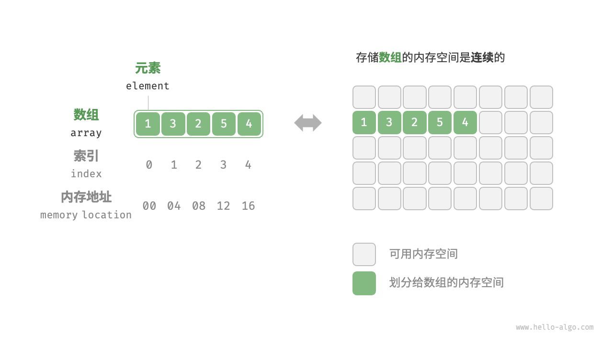
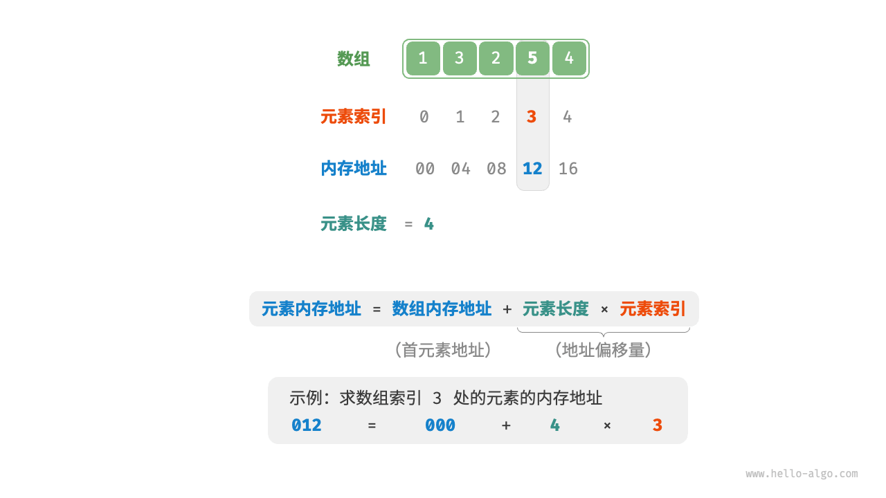

# 数据结构和算法

## 数据结构

### 3.1数据结构分类

常见的数据结构包括数组、链表、栈、队列、哈希表、树、堆、图，它们可以从“逻辑结构”和“物理结构”两个维度进行分类。

#### 3.1.1逻辑结构：线性与非线性

**逻辑结构揭示了数据元素之间的逻辑关系**。

- **线性数据结构**：数组、链表、栈、队列、哈希表，元素之间是一对一的顺序关系。
- **非线性数据结构**：树、堆、图、哈希表。


非线性数据结构可以进一步划分为树形结构和网状结构。

- **树形结构**：树、堆、哈希表，元素之间是一对多的关系。
- **网状结构**：图，元素之间是多对多的关系。


#### 3.1.2物理结构：连续与分散

**当算法程序运行时，正在处理的数据主要存储在内存中**。

**系统通过内存地址来访问目标位置的数据**。

**物理结构反映了数据在计算机内存中的存储方式**，可分为连续空间存储（数组）和分散空间存储（链表）。物理结构从底层决定了数据的访问、更新、增删等操作方法，两种物理结构在时间效率和空间效率方面呈现出互补的特点。


值得说明的是，**所有数据结构都是基于数组、链表或二者的组合实现的**。例如，栈和队列既可以使用数组实现，也可以使用链表实现；而哈希表的实现可能同时包含数组和链表。

- **基于数组可实现**：栈、队列、哈希表、树、堆、图、矩阵、张量（维度 ≥3 的数组）等。
- **基于链表可实现**：栈、队列、哈希表、树、堆、图等。

链表在初始化后，仍可以在程序运行过程中对其长度进行调整，因此也称“动态数据结构”。数组在初始化后长度不可变，因此也称“静态数据结构”。值得注意的是，数组可通过重新分配内存实现长度变化，从而具备一定的“动态性”。


### 3.2基本数据类型

**基本数据类型是 CPU 可以直接进行运算的类型**，在算法中直接被使用，主要包括以下几种。

- 整数类型 `byte`、`short`、`int`、`long` 。
- 浮点数类型 `float`、`double` ，用于表示小数。
- 字符类型 `char` ，用于表示各种语言的字母、标点符号甚至表情符号等。
- 布尔类型 `bool` ，用于表示“是”与“否”判断。

**基本数据类型以二进制的形式存储在计算机中**。一个二进制位即为 1 比特。在绝大多数现代操作系统中，1 字节（byte）由 8 比特（bit）组成。

基本数据类型的取值范围取决于其占用的空间大小。下面以 Java 为例。

- 整数类型 `byte` 占用 1 字节 = 8 比特 ，可以表示 28 个数字。
- 整数类型 `int` 占用 4 字节 = 32 比特 ，可以表示 232 个数字


请注意，表 3-1 针对的是 Java 的基本数据类型的情况。每种编程语言都有各自的数据类型定义，它们的占用空间、取值范围和默认值可能会有所不同。

- 在 Python 中，整数类型 `int` 可以是任意大小，只受限于可用内存；浮点数 `float` 是双精度 64 位；没有 `char` 类型，单个字符实际上是长度为 1 的字符串 `str` 。
- C 和 C++ 未明确规定基本数据类型的大小，而因实现和平台各异。表 3-1 遵循 LP64 [数据模型](https://en.cppreference.com/w/cpp/language/types#Properties)，其用于包括 Linux 和 macOS 在内的 Unix 64 位操作系统。
- 字符 `char` 的大小在 C 和 C++ 中为 1 字节，在大多数编程语言中取决于特定的字符编码方法，详见“字符编码”章节。
- 即使表示布尔量仅需 1 位（0 或 1），它在内存中通常也存储为 1 字节。这是因为现代计算机 CPU 通常将 1 字节作为最小寻址内存单元。


**基本数据类型提供了数据的“内容类型”，而数据结构提供了数据的“组织方式”**。例如以下代码，我们用相同的数据结构（数组）来存储与表示不同的基本数据类型，包括 `int`、`float`、`char`、`bool` 等。

```java
// 使用多种基本数据类型来初始化数组
int[] numbers = new int[5];
float[] decimals = new float[5];
char[] characters = new char[5];
boolean[] bools = new boolean[5];
```


### 小结

#### 1.重点回顾

- 数据结构可以从逻辑结构和物理结构两个角度进行分类。逻辑结构描述了数据元素之间的逻辑关系，而物理结构描述了数据在计算机内存中的存储方式。
- 常见的逻辑结构包括线性、树状和网状等。通常我们根据逻辑结构将数据结构分为线性（数组、链表、栈、队列）和非线性（树、图、堆）两种。哈希表的实现可能同时包含线性数据结构和非线性数据结构。
- 当程序运行时，数据被存储在计算机内存中。每个内存空间都拥有对应的内存地址，程序通过这些内存地址访问数据。
- 物理结构主要分为连续空间存储（数组）和分散空间存储（链表）。所有数据结构都是由数组、链表或两者的组合实现的。
- 计算机中的基本数据类型包括整数 `byte`、`short`、`int`、`long` ，浮点数 `float`、`double` ，字符 `char` 和布尔 `bool` 。它们的取值范围取决于占用空间大小和表示方式。
- 原码、反码和补码是在计算机中编码数字的三种方法，它们之间可以相互转换。整数的原码的最高位是符号位，其余位是数字的值。
- 整数在计算机中是以补码的形式存储的。在补码表示下，计算机可以对正数和负数的加法一视同仁，不需要为减法操作单独设计特殊的硬件电路，并且不存在正负零歧义的问题。
- 浮点数的编码由 1 位符号位、8 位指数位和 23 位分数位构成。由于存在指数位，因此浮点数的取值范围远大于整数，代价是牺牲了精度。
- ASCII 码是最早出现的英文字符集，长度为 1 字节，共收录 127 个字符。GBK 字符集是常用的中文字符集，共收录两万多个汉字。Unicode 致力于提供一个完整的字符集标准，收录世界上各种语言的字符，从而解决由于字符编码方法不一致而导致的乱码问题。
- UTF-8 是最受欢迎的 Unicode 编码方法，通用性非常好。它是一种变长的编码方法，具有很好的扩展性，有效提升了存储空间的使用效率。UTF-16 和 UTF-32 是等长的编码方法。在编码中文时，UTF-16 占用的空间比 UTF-8 更小。Java 和 C# 等编程语言默认使用 UTF-16 编码。


## 数组与链表

### 4.1数组

数组（array）是一种线性数据结构，其将相同类型的元素存储在连续的内存空间中。我们将元素在数组中的位置称为该元素的索引（index）。



#### 4.1.1数组常用操作

1.初始化数组

我们可以根据需求选用数组的两种初始化方式：无初始值、给定初始值。在未指定初始值的情况下，大多数编程语言会将数组元素初始化为 对应数据类型的默认值：

```java
/* 初始化数组 */
int[] arr = new int[5]; // { 0, 0, 0, 0, 0 }
int[] nums = { 1, 3, 2, 5, 4 };
```


2.访问元素

数组元素被存储在连续的内存空间中，这意味着计算数组元素的内存地址非常容易。给定数组内存地址（首元素内存地址）和某个元素的索引，我们可以使用图 4-2 所示的公式计算得到该元素的内存地址，从而直接访问该元素。



**索引本质上是内存地址的偏移量**。首个元素的地址偏移量是 0 ，因此它的索引为 0 是合理的。

在数组中访问元素非常高效，我们可以在 𝑂(1) 时间内随机访问数组中的任意一个元素。

```java
/*随机访问元素*/
public static int randomAccess(int[] nums){
    // 在区间 [0, nums.length) 中随机抽取一个数字
    int randomIndex = ThreadLocalRandom.current().nextInt(0, nums.length);
    // 获取并返回随机元素
    return nums[randomIndex];
}
```


3.插入元素

数组元素在内存中是“紧挨着的”，它们之间没有空间再存放任何数据。如图 4-3 所示，如果想在数组中间插入一个元素，则需要将该元素之后的所有元素都向后移动一位，之后再把元素赋值给该索引。


值得注意的是，由于**数组的长度是固定的**，因此插入一个元素必定会导致数组尾部元素“丢失”。我们将这个问题的解决方案留在“列表”章节中讨论。

```java
/* 在数组的索引 index 处插入元素 num */
public void insert(int[] nums, int num, int index) {
    // 将index以后的数值都后移一位
    for (int i = nums.length - 1; i > index; i--) {
        nums[i] = nums[i - 1];
    }
    // 将 num 赋给 index 处的元素
    nums[index] = num;
}
```


4.删除元素

同理，如图 4-4 所示，若想删除索引 𝑖 处的元素，则需要把索引 𝑖 之后的元素都向前移动一位。	

```java
/* 删除索引 index 处的元素 */
public void remove(int[] nums, int index) {
    for (int i = index; i < nums.length; i++) {
        nums[index] = nums[index + 1];
    }
}
```


总的来看，数组的插入与删除操作有以下缺点。

- **时间复杂度高**：数组的插入和删除的平均时间复杂度均为 𝑂(𝑛) ，其中 𝑛 为数组长度。
- **丢失元素**：由于数组的长度不可变，因此在插入元素后，超出数组长度范围的元素会丢失。
- **内存浪费**：我们可以初始化一个比较长的数组，只用前面一部分，这样在插入数据时，丢失的末尾元素都是“无意义”的，但这样做会造成部分内存空间浪费。


5.遍历数组

在大多数编程语言中，我们既可以通过索引遍历数组，也可以直接遍历获取数组中的每个元素：

```java
/* 遍历数组 */
public void traverse(int[] nums){
    // 通过索引遍历数组
    for (int i = 0; i < nums.length; i++) {
        System.out.println(nums[i]);
    }

    // 直接遍历数组元素
    for (int num : nums) {
        System.out.println(num);
    }
}
```


6.查找元素

在数组中查找指定元素需要遍历数组，每轮判断元素值是否匹配，若匹配则输出对应索引。	

```java
/* 在数组中查找指定元素 */
public int find(int[] nums, int target) {
    for (int i = 0; i < nums.length; i++) {
        if (nums[i] == target) {
            return i;
        }
    }
    return -1;
}
```


7.扩容数组

在复杂的系统环境中，程序难以保证数组之后的内存空间是可用的，从而无法安全地扩展数组容量。因此在大多数编程语言中，**数组的长度是不可变的**。

如果我们希望扩容数组，则需重新建立一个更大的数组，然后把原数组元素依次复制到新数组。这是一个 𝑂(𝑛) 的操作，在数组很大的情况下非常耗时。代码如下所示：

```java
/* 扩展数组长度 */
public int[] extend(int[] nums, int enlarge){
    // 初始化一个扩展长度后的数组
    int[] res =  new int[nums.length + enlarge];
    // 将原数组中的所有元素复制到新数组
    for (int i = 0; i < nums.length; i++) {
        res[i] = nums[i];
    }
    // 返回扩展后的新数组
    return res;
}
```


#### 4.1.2数组的优点与局限性

数组存储在连续的内存空间内，且元素类型相同。这种做法包含丰富的先验信息，系统可以利用这些信息来优化数据结构的操作效率。

- **空间效率高**：数组为数据分配了连续的内存块，无须额外的结构开销。
- **支持随机访问**：数组允许在 𝑂(1) 时间内访问任何元素。
- **缓存局部性**：当访问数组元素时，计算机不仅会加载它，还会缓存其周围的其他数据，从而借助高速缓存来提升后续操作的执行速度。

连续空间存储是一把双刃剑，其存在以下局限性。

- **插入与删除效率低**：当数组中元素较多时，插入与删除操作需要移动大量的元素。
- **长度不可变**：数组在初始化后长度就固定了，扩容数组需要将所有数据复制到新数组，开销很大。
- **空间浪费**：如果数组分配的大小超过实际所需，那么多余的空间就被浪费了。


#### 4.1.3数组典型应用

数组是一种基础且常见的数据结构，既频繁应用在各类算法之中，也可用于实现各种复杂数据结构。

- **随机访问**：如果我们想随机抽取一些样本，那么可以用数组存储，并生成一个随机序列，根据索引实现随机抽样。
- **排序和搜索**：数组是排序和搜索算法最常用的数据结构。快速排序、归并排序、二分查找等都主要在数组上进行。
- **查找表**：当需要快速查找一个元素或其对应关系时，可以使用数组作为查找表。假如我们想实现字符到 ASCII 码的映射，则可以将字符的 ASCII 码值作为索引，对应的元素存放在数组中的对应位置。
- **机器学习**：神经网络中大量使用了向量、矩阵、张量之间的线性代数运算，这些数据都是以数组的形式构建的。数组是神经网络编程中最常使用的数据结构。
- **数据结构实现**：数组可以用于实现栈、队列、哈希表、堆、图等数据结构。例如，图的邻接矩阵表示实际上是一个二维数组。


### 4.2链表

链表（linked list）是一种线性数据结构，其中的每个元素都是一个节点对象，各个节点通过“引用”相连接。引用记录了下一个节点的内存地址，通过它可以从当前节点访问到下一个节点。

链表的设计使得各个节点可以分散存储在内存各处，它们的内存地址无须连续。


链表的组成单位是节点（node）对象。每个节点都包含两项数据：节点的“值”和指向下一节点的“引用”。

- 链表的首个节点被称为“**头节点**”，最后一个节点被称为“**尾节点**”。
- 尾节点指向的是“空”，它在 Java、C++ 和 Python 中分别被记为 `null`、`nullptr` 和 `None` 。
- 在 C、C++、Go 和 Rust 等支持指针的语言中，上述“引用”应被替换为“指针”。

链表节点 `ListNode` 除了包含值，还需额外保存一个引用（指针）。因此在相同数据量下，**链表比数组占用更多的内存空间**。

```java
/* 链表节点类 */
class ListNode {
    int val;        // 节点值
    ListNode next;  // 指向下一节点的引用
    ListNode(int x) { val = x; }  // 构造函数
}
```


#### 4.2.1链表常用操作

1.初始化链表

建立链表分为两步，第一步是初始化各个节点对象，第二步是构建节点之间的引用关系。初始化完成后，我们就可以从链表的头节点出发，通过引用指向 `next` 依次访问所有节点。

```java	
/* 初始化链表 */
// 初始化各个节点
ListNode n0 = new ListNode(1);
ListNode n1 = new ListNode(3);
ListNode n2 = new ListNode(2);
ListNode n3 = new ListNode(5);
ListNode n4 = new ListNode(4);
// 构建节点之间的引用
n0.next = n1;
n1.next = n2;
n2.next = n3;
n3.next = n4;
```


2.插入节点

在链表中插入节点非常容易。如图 4-6 所示，假设我们想在相邻的两个节点 `n0` 和 `n1` 之间插入一个新节点 `p` ，**则只需改变两个节点引用（指针）即可**，时间复杂度为 𝑂(1) 。

相比之下，在数组中插入元素的时间复杂度为 𝑂(𝑛) ，在大数据量下的效率较低。


```java
/* 在链表的节点 n0 之后插入节点 P */
public void insert(ListNode n0, ListNode p){
    p.next = n0.next;
    n0.next = p;
}
```


3.删除节点

如图 4-7 所示，在链表中删除节点也非常方便，**只需改变一个节点的引用（指针）即可**。

请注意，尽管在删除操作完成后节点 `P` 仍然指向 `n1` ，但实际上遍历此链表已经无法访问到 `P` ，这意味着 `P` 已经不再属于该链表了。


4.访问节点

**在链表中访问节点的效率较低**。如上一节所述，我们可以在 𝑂(1) 时间下访问数组中的任意元素。链表则不然，程序需要从头节点出发，逐个向后遍历，直至找到目标节点。也就是说，访问链表的第 𝑖 个节点需要循环 𝑖−1 轮，时间复杂度为 𝑂(𝑛) 。

```java
/* 访问链表中索引为 index 的节点 */
public ListNode access(ListNode head, int index) {
    for (int i = 0; i < index; i++) {
        if (head == null){
            return null;
        }
        head = head.next;
    }
    return head;
}
```


5.查找节点

遍历链表，查找其中值为 `target` 的节点，输出该节点在链表中的索引。此过程也属于线性查找。

```java
/* 在链表中查找值为 target 的首个节点 */
public int find(ListNode head, int target) {
    int index = 0;
    while (head != null){
        if (head.val == target){
            return index;
        }
        head = head.next;
        index++;
    }
    return -1;
}
```


#### 4.2.2数组vs链表

表 4-1 总结了数组和链表的各项特点并对比了操作效率。由于它们采用两种相反的存储策略，因此各种性质和操作效率也呈现对立的特点。


#### 4.2.3常见链表类型

如图 4-8 所示，常见的链表类型包括三种。

- **单向链表**：即前面介绍的普通链表。单向链表的节点包含值和指向下一节点的引用两项数据。我们将首个节点称为头节点，将最后一个节点称为尾节点，尾节点指向空 `None` 。
- **环形链表**：如果我们令单向链表的尾节点指向头节点（首尾相接），则得到一个环形链表。在环形链表中，任意节点都可以视作头节点。
- **双向链表**：与单向链表相比，双向链表记录了两个方向的引用。双向链表的节点定义同时包含指向后继节点（下一个节点）和前驱节点（上一个节点）的引用（指针）。相较于单向链表，双向链表更具灵活性，可以朝两个方向遍历链表，但相应地也需要占用更多的内存空间。

```java
/* 双向链表节点类 */
class ListNode {
    int val;        // 节点值
    ListNode next;  // 指向后继节点的引用
    ListNode prev;  // 指向前驱节点的引用
    ListNode(int x) { val = x; }  // 构造函数
}
```


#### 4.2.4链表典型应用

单向链表通常用于实现栈、队列、哈希表和图等数据结构。

- **栈与队列**：当插入和删除操作都在链表的一端进行时，它表现的特性为先进后出，对应栈；当插入操作在链表的一端进行，删除操作在链表的另一端进行，它表现的特性为先进先出，对应队列。
- **哈希表**：链式地址是解决哈希冲突的主流方案之一，在该方案中，所有冲突的元素都会被放到一个链表中。
- **图**：邻接表是表示图的一种常用方式，其中图的每个顶点都与一个链表相关联，链表中的每个元素都代表与该顶点相连的其他顶点。


双向链表常用于需要快速查找前一个和后一个元素的场景。

- **高级数据结构**：比如在红黑树、B 树中，我们需要访问节点的父节点，这可以通过在节点中保存一个指向父节点的引用来实现，类似于双向链表。
- **浏览器历史**：在网页浏览器中，当用户点击前进或后退按钮时，浏览器需要知道用户访问过的前一个和后一个网页。双向链表的特性使得这种操作变得简单。
- **LRU 算法**：在缓存淘汰（LRU）算法中，我们需要快速找到最近最少使用的数据，以及支持快速添加和删除节点。这时候使用双向链表就非常合适。


环形链表常用于需要周期性操作的场景，比如操作系统的资源调度。

- **时间片轮转调度算法**：在操作系统中，时间片轮转调度算法是一种常见的 CPU 调度算法，它需要对一组进程进行循环。每个进程被赋予一个时间片，当时间片用完时，CPU 将切换到下一个进程。这种循环操作可以通过环形链表来实现。
- **数据缓冲区**：在某些数据缓冲区的实现中，也可能会使用环形链表。比如在音频、视频播放器中，数据流可能会被分成多个缓冲块并放入一个环形链表，以便实现无缝播放。


### 4.3列表

列表（list）是一个**抽象的数据结构**概念，它表示元素的有序集合，支持元素访问、修改、添加、删除和遍历等操作，**无须使用者考虑容量限制的问题**。列表可以基于链表或数组实现。

- 链表天然可以看作一个列表，其支持元素增删查改操作，并且可以灵活动态扩容。
- 数组也支持元素增删查改，但由于其长度不可变，因此只能看作一个具有长度限制的列表。

当使用数组实现列表时，**长度不可变的性质会导致列表的实用性降低**。这是因为我们通常无法事先确定需要存储多少数据，从而难以选择合适的列表长度。若长度过小，则很可能无法满足使用需求；若长度过大，则会造成内存空间浪费。

实际上，**许多编程语言中的标准库提供的列表是基于动态数组实现的**，例如 Python 中的 `list` 、Java 中的 `ArrayList` 、C++ 中的 `vector` 和 C# 中的 `List` 等。


#### 4.3.1列表常用操作

1.初始化列表

我们通常使用“无初始值”和“有初始值”这两种初始化方法：

```java
/* 初始化列表 */
// 无初始值
List<Integer> nums1 = new ArrayList<>();
// 有初始值（注意数组的元素类型需为 int[] 的包装类 Integer[]）
Integer[] numbers = new Integer[] { 1, 3, 2, 5, 4 };
List<Integer> nums = new ArrayList<>(Arrays.asList(numbers));
```


2.访问元素

```java
/* 访问元素 */
int num = nums.get(1);  // 访问索引 1 处的元素

/* 更新元素 */
nums.set(1, 0);  // 将索引 1 处的元素更新为 0
```


3.插入与删除元素

```java
/* 清空列表 */
nums.clear();

/* 在尾部添加元素 */
nums.add(1);
nums.add(3);
nums.add(2);
nums.add(5);
nums.add(4);

/* 在中间插入元素 */
nums.add(3, 6);  // 在索引 3 处插入数字 6

/* 删除元素 */
nums.remove(3);  // 删除索引 3 处的元素
```


4.遍历列表

```java
/* 通过索引遍历列表 */
int count = 0;
for (int i = 0; i < nums.size(); i++) {
    count += nums.get(i);
}

/* 直接遍历列表元素 */
for (int num : nums) {
    count += num;
}
```


5.拼接列表

```java
/* 拼接两个列表 */
List<Integer> nums1 = new ArrayList<>(Arrays.asList(new Integer[] { 6, 8, 7, 10, 9 }));
nums.addAll(nums1);  // 将列表 nums1 拼接到 nums 之后
```


6.排序列表

完成列表排序后，我们便可以使用在数组类算法题中经常考查的“二分查找”和“双指针”算法。

```java
/* 排序列表 */
Collections.sort(nums);  // 排序后，列表元素从小到大排列
```


#### 4.3.2列表实现

许多编程语言内置了列表，例如 Java、C++、Python 等。它们的实现比较复杂，各个参数的设定也非常考究，例如初始容量、扩容倍数等。感兴趣的读者可以查阅源码进行学习。

为了加深对列表工作原理的理解，我们尝试实现一个简易版列表，包括以下三个重点设计。

- **初始容量**：选取一个合理的数组初始容量。在本示例中，我们选择 10 作为初始容量。
- **数量记录**：声明一个变量 `size` ，用于记录列表当前元素数量，并随着元素插入和删除实时更新。根据此变量，我们可以定位列表尾部，以及判断是否需要扩容。
- **扩容机制**：若插入元素时列表容量已满，则需要进行扩容。先根据扩容倍数创建一个更大的数组，再将当前数组的所有元素依次移动至新数组。在本示例中，我们规定每次将数组扩容至之前的 2 倍。
