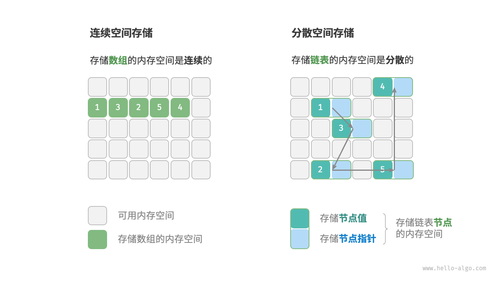
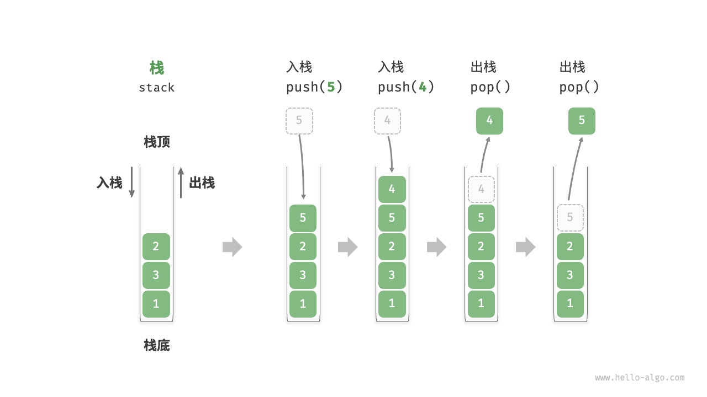
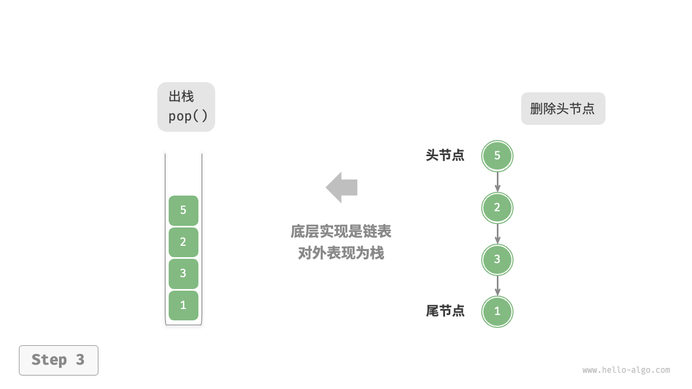
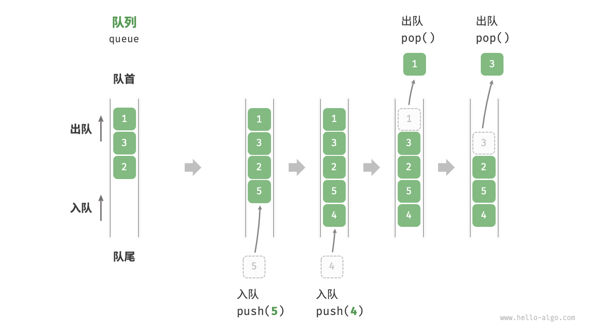
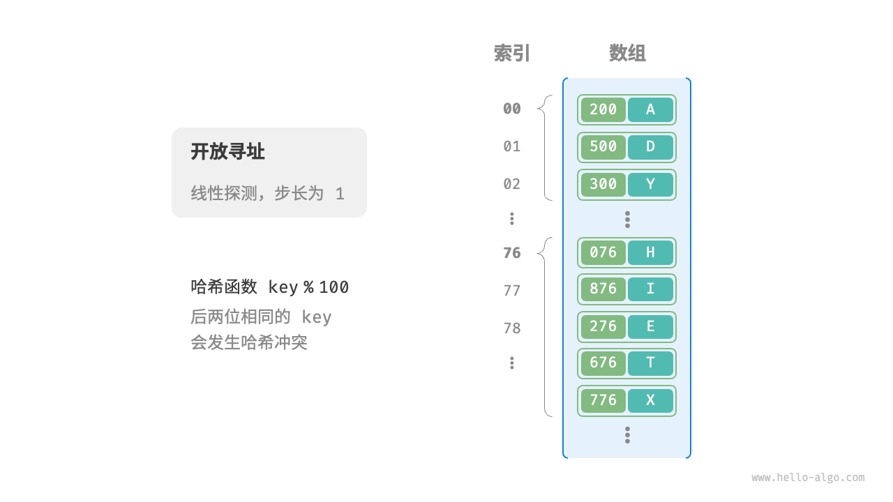
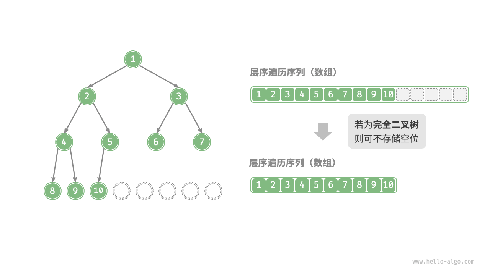

# 数据结构和算法

## 数据结构

### 3.1数据结构分类

常见的数据结构包括数组、链表、栈、队列、哈希表、树、堆、图，它们可以从“逻辑结构”和“物理结构”两个维度进行分类。

#### 3.1.1逻辑结构：线性与非线性

**逻辑结构揭示了数据元素之间的逻辑关系**。

- **线性数据结构**：数组、链表、栈、队列、哈希表，元素之间是一对一的顺序关系。
- **非线性数据结构**：树、堆、图、哈希表。


非线性数据结构可以进一步划分为树形结构和网状结构。

- **树形结构**：树、堆、哈希表，元素之间是一对多的关系。
- **网状结构**：图，元素之间是多对多的关系。


#### 3.1.2物理结构：连续与分散

**当算法程序运行时，正在处理的数据主要存储在内存中**。

**系统通过内存地址来访问目标位置的数据**。

**物理结构反映了数据在计算机内存中的存储方式**，可分为连续空间存储（数组）和分散空间存储（链表）。物理结构从底层决定了数据的访问、更新、增删等操作方法，两种物理结构在时间效率和空间效率方面呈现出互补的特点。



值得说明的是，**所有数据结构都是基于数组、链表或二者的组合实现的**。例如，栈和队列既可以使用数组实现，也可以使用链表实现；而哈希表的实现可能同时包含数组和链表。

- **基于数组可实现**：栈、队列、哈希表、树、堆、图、矩阵、张量（维度 ≥3 的数组）等。
- **基于链表可实现**：栈、队列、哈希表、树、堆、图等。

链表在初始化后，仍可以在程序运行过程中对其长度进行调整，因此也称“动态数据结构”。数组在初始化后长度不可变，因此也称“静态数据结构”。值得注意的是，数组可通过重新分配内存实现长度变化，从而具备一定的“动态性”。


### 3.2基本数据类型

**基本数据类型是 CPU 可以直接进行运算的类型**，在算法中直接被使用，主要包括以下几种。

- 整数类型 `byte`、`short`、`int`、`long` 。
- 浮点数类型 `float`、`double` ，用于表示小数。
- 字符类型 `char` ，用于表示各种语言的字母、标点符号甚至表情符号等。
- 布尔类型 `bool` ，用于表示“是”与“否”判断。

**基本数据类型以二进制的形式存储在计算机中**。一个二进制位即为 1 比特。在绝大多数现代操作系统中，1 字节（byte）由 8 比特（bit）组成。

基本数据类型的取值范围取决于其占用的空间大小。下面以 Java 为例。

- 整数类型 `byte` 占用 1 字节 = 8 比特 ，可以表示 28 个数字。
- 整数类型 `int` 占用 4 字节 = 32 比特 ，可以表示 232 个数字


请注意，表 3-1 针对的是 Java 的基本数据类型的情况。每种编程语言都有各自的数据类型定义，它们的占用空间、取值范围和默认值可能会有所不同。

- 在 Python 中，整数类型 `int` 可以是任意大小，只受限于可用内存；浮点数 `float` 是双精度 64 位；没有 `char` 类型，单个字符实际上是长度为 1 的字符串 `str` 。
- C 和 C++ 未明确规定基本数据类型的大小，而因实现和平台各异。表 3-1 遵循 LP64 [数据模型](https://en.cppreference.com/w/cpp/language/types#Properties)，其用于包括 Linux 和 macOS 在内的 Unix 64 位操作系统。
- 字符 `char` 的大小在 C 和 C++ 中为 1 字节，在大多数编程语言中取决于特定的字符编码方法，详见“字符编码”章节。
- 即使表示布尔量仅需 1 位（0 或 1），它在内存中通常也存储为 1 字节。这是因为现代计算机 CPU 通常将 1 字节作为最小寻址内存单元。


**基本数据类型提供了数据的“内容类型”，而数据结构提供了数据的“组织方式”**。例如以下代码，我们用相同的数据结构（数组）来存储与表示不同的基本数据类型，包括 `int`、`float`、`char`、`bool` 等。

```java
// 使用多种基本数据类型来初始化数组
int[] numbers = new int[5];
float[] decimals = new float[5];
char[] characters = new char[5];
boolean[] bools = new boolean[5];
```


### 小结

#### 1.重点回顾

- 数据结构可以从逻辑结构和物理结构两个角度进行分类。逻辑结构描述了数据元素之间的逻辑关系，而物理结构描述了数据在计算机内存中的存储方式。
- 常见的逻辑结构包括线性、树状和网状等。通常我们根据逻辑结构将数据结构分为线性（数组、链表、栈、队列）和非线性（树、图、堆）两种。哈希表的实现可能同时包含线性数据结构和非线性数据结构。
- 当程序运行时，数据被存储在计算机内存中。每个内存空间都拥有对应的内存地址，程序通过这些内存地址访问数据。
- 物理结构主要分为连续空间存储（数组）和分散空间存储（链表）。所有数据结构都是由数组、链表或两者的组合实现的。
- 计算机中的基本数据类型包括整数 `byte`、`short`、`int`、`long` ，浮点数 `float`、`double` ，字符 `char` 和布尔 `bool` 。它们的取值范围取决于占用空间大小和表示方式。
- 原码、反码和补码是在计算机中编码数字的三种方法，它们之间可以相互转换。整数的原码的最高位是符号位，其余位是数字的值。
- 整数在计算机中是以补码的形式存储的。在补码表示下，计算机可以对正数和负数的加法一视同仁，不需要为减法操作单独设计特殊的硬件电路，并且不存在正负零歧义的问题。
- 浮点数的编码由 1 位符号位、8 位指数位和 23 位分数位构成。由于存在指数位，因此浮点数的取值范围远大于整数，代价是牺牲了精度。
- ASCII 码是最早出现的英文字符集，长度为 1 字节，共收录 127 个字符。GBK 字符集是常用的中文字符集，共收录两万多个汉字。Unicode 致力于提供一个完整的字符集标准，收录世界上各种语言的字符，从而解决由于字符编码方法不一致而导致的乱码问题。
- UTF-8 是最受欢迎的 Unicode 编码方法，通用性非常好。它是一种变长的编码方法，具有很好的扩展性，有效提升了存储空间的使用效率。UTF-16 和 UTF-32 是等长的编码方法。在编码中文时，UTF-16 占用的空间比 UTF-8 更小。Java 和 C# 等编程语言默认使用 UTF-16 编码。


## 数组与链表

### 4.1数组

数组（array）是一种线性数据结构，其将相同类型的元素存储在连续的内存空间中。我们将元素在数组中的位置称为该元素的索引（index）。


#### 4.1.1数组常用操作

1.初始化数组

我们可以根据需求选用数组的两种初始化方式：无初始值、给定初始值。在未指定初始值的情况下，大多数编程语言会将数组元素初始化为 对应数据类型的默认值：

```java
/* 初始化数组 */
int[] arr = new int[5]; // { 0, 0, 0, 0, 0 }
int[] nums = { 1, 3, 2, 5, 4 };
```


2.访问元素

数组元素被存储在连续的内存空间中，这意味着计算数组元素的内存地址非常容易。给定数组内存地址（首元素内存地址）和某个元素的索引，我们可以使用图 4-2 所示的公式计算得到该元素的内存地址，从而直接访问该元素。


**索引本质上是内存地址的偏移量**。首个元素的地址偏移量是 0 ，因此它的索引为 0 是合理的。

在数组中访问元素非常高效，我们可以在 𝑂(1) 时间内随机访问数组中的任意一个元素。

```java
/*随机访问元素*/
public static int randomAccess(int[] nums){
    // 在区间 [0, nums.length) 中随机抽取一个数字
    int randomIndex = ThreadLocalRandom.current().nextInt(0, nums.length);
    // 获取并返回随机元素
    return nums[randomIndex];
}
```


3.插入元素

数组元素在内存中是“紧挨着的”，它们之间没有空间再存放任何数据。如图 4-3 所示，如果想在数组中间插入一个元素，则需要将该元素之后的所有元素都向后移动一位，之后再把元素赋值给该索引。


值得注意的是，由于**数组的长度是固定的**，因此插入一个元素必定会导致数组尾部元素“丢失”。我们将这个问题的解决方案留在“列表”章节中讨论。

```java
/* 在数组的索引 index 处插入元素 num */
public void insert(int[] nums, int num, int index) {
    // 将index以后的数值都后移一位
    for (int i = nums.length - 1; i > index; i--) {
        nums[i] = nums[i - 1];
    }
    // 将 num 赋给 index 处的元素
    nums[index] = num;
}
```


4.删除元素

同理，如图 4-4 所示，若想删除索引 𝑖 处的元素，则需要把索引 𝑖 之后的元素都向前移动一位。	

```java
/* 删除索引 index 处的元素 */
public void remove(int[] nums, int index) {
    for (int i = index; i < nums.length; i++) {
        nums[index] = nums[index + 1];
    }
}
```


总的来看，数组的插入与删除操作有以下缺点。

- **时间复杂度高**：数组的插入和删除的平均时间复杂度均为 𝑂(𝑛) ，其中 𝑛 为数组长度。
- **丢失元素**：由于数组的长度不可变，因此在插入元素后，超出数组长度范围的元素会丢失。
- **内存浪费**：我们可以初始化一个比较长的数组，只用前面一部分，这样在插入数据时，丢失的末尾元素都是“无意义”的，但这样做会造成部分内存空间浪费。


5.遍历数组

在大多数编程语言中，我们既可以通过索引遍历数组，也可以直接遍历获取数组中的每个元素：

```java
/* 遍历数组 */
public void traverse(int[] nums){
    // 通过索引遍历数组
    for (int i = 0; i < nums.length; i++) {
        System.out.println(nums[i]);
    }

    // 直接遍历数组元素
    for (int num : nums) {
        System.out.println(num);
    }
}
```


6.查找元素

在数组中查找指定元素需要遍历数组，每轮判断元素值是否匹配，若匹配则输出对应索引。	

```java
/* 在数组中查找指定元素 */
public int find(int[] nums, int target) {
    for (int i = 0; i < nums.length; i++) {
        if (nums[i] == target) {
            return i;
        }
    }
    return -1;
}
```


7.扩容数组

在复杂的系统环境中，程序难以保证数组之后的内存空间是可用的，从而无法安全地扩展数组容量。因此在大多数编程语言中，**数组的长度是不可变的**。

如果我们希望扩容数组，则需重新建立一个更大的数组，然后把原数组元素依次复制到新数组。这是一个 𝑂(𝑛) 的操作，在数组很大的情况下非常耗时。代码如下所示：

```java
/* 扩展数组长度 */
public int[] extend(int[] nums, int enlarge){
    // 初始化一个扩展长度后的数组
    int[] res =  new int[nums.length + enlarge];
    // 将原数组中的所有元素复制到新数组
    for (int i = 0; i < nums.length; i++) {
        res[i] = nums[i];
    }
    // 返回扩展后的新数组
    return res;
}
```


#### 4.1.2数组的优点与局限性

数组存储在连续的内存空间内，且元素类型相同。这种做法包含丰富的先验信息，系统可以利用这些信息来优化数据结构的操作效率。

- **空间效率高**：数组为数据分配了连续的内存块，无须额外的结构开销。
- **支持随机访问**：数组允许在 𝑂(1) 时间内访问任何元素。
- **缓存局部性**：当访问数组元素时，计算机不仅会加载它，还会缓存其周围的其他数据，从而借助高速缓存来提升后续操作的执行速度。

连续空间存储是一把双刃剑，其存在以下局限性。

- **插入与删除效率低**：当数组中元素较多时，插入与删除操作需要移动大量的元素。
- **长度不可变**：数组在初始化后长度就固定了，扩容数组需要将所有数据复制到新数组，开销很大。
- **空间浪费**：如果数组分配的大小超过实际所需，那么多余的空间就被浪费了。


#### 4.1.3数组典型应用

数组是一种基础且常见的数据结构，既频繁应用在各类算法之中，也可用于实现各种复杂数据结构。

- **随机访问**：如果我们想随机抽取一些样本，那么可以用数组存储，并生成一个随机序列，根据索引实现随机抽样。
- **排序和搜索**：数组是排序和搜索算法最常用的数据结构。快速排序、归并排序、二分查找等都主要在数组上进行。
- **查找表**：当需要快速查找一个元素或其对应关系时，可以使用数组作为查找表。假如我们想实现字符到 ASCII 码的映射，则可以将字符的 ASCII 码值作为索引，对应的元素存放在数组中的对应位置。
- **机器学习**：神经网络中大量使用了向量、矩阵、张量之间的线性代数运算，这些数据都是以数组的形式构建的。数组是神经网络编程中最常使用的数据结构。
- **数据结构实现**：数组可以用于实现栈、队列、哈希表、堆、图等数据结构。例如，图的邻接矩阵表示实际上是一个二维数组。


### 4.2链表

链表（linked list）是一种线性数据结构，其中的每个元素都是一个节点对象，各个节点通过“引用”相连接。引用记录了下一个节点的内存地址，通过它可以从当前节点访问到下一个节点。

链表的设计使得各个节点可以分散存储在内存各处，它们的内存地址无须连续。


链表的组成单位是节点（node）对象。每个节点都包含两项数据：节点的“值”和指向下一节点的“引用”。

- 链表的首个节点被称为“**头节点**”，最后一个节点被称为“**尾节点**”。
- 尾节点指向的是“空”，它在 Java、C++ 和 Python 中分别被记为 `null`、`nullptr` 和 `None` 。
- 在 C、C++、Go 和 Rust 等支持指针的语言中，上述“引用”应被替换为“指针”。

链表节点 `ListNode` 除了包含值，还需额外保存一个引用（指针）。因此在相同数据量下，**链表比数组占用更多的内存空间**。

```java
/* 链表节点类 */
class ListNode {
    int val;        // 节点值
    ListNode next;  // 指向下一节点的引用
    ListNode(int x) { val = x; }  // 构造函数
}
```


#### 4.2.1链表常用操作

1.初始化链表

建立链表分为两步，第一步是初始化各个节点对象，第二步是构建节点之间的引用关系。初始化完成后，我们就可以从链表的头节点出发，通过引用指向 `next` 依次访问所有节点。

```java	
/* 初始化链表 */
// 初始化各个节点
ListNode n0 = new ListNode(1);
ListNode n1 = new ListNode(3);
ListNode n2 = new ListNode(2);
ListNode n3 = new ListNode(5);
ListNode n4 = new ListNode(4);
// 构建节点之间的引用
n0.next = n1;
n1.next = n2;
n2.next = n3;
n3.next = n4;
```


2.插入节点

在链表中插入节点非常容易。如图 4-6 所示，假设我们想在相邻的两个节点 `n0` 和 `n1` 之间插入一个新节点 `p` ，**则只需改变两个节点引用（指针）即可**，时间复杂度为 𝑂(1) 。

相比之下，在数组中插入元素的时间复杂度为 𝑂(𝑛) ，在大数据量下的效率较低。


```java
/* 在链表的节点 n0 之后插入节点 P */
public void insert(ListNode n0, ListNode p){
    p.next = n0.next;
    n0.next = p;
}
```


3.删除节点

如图 4-7 所示，在链表中删除节点也非常方便，**只需改变一个节点的引用（指针）即可**。

请注意，尽管在删除操作完成后节点 `P` 仍然指向 `n1` ，但实际上遍历此链表已经无法访问到 `P` ，这意味着 `P` 已经不再属于该链表了。


4.访问节点

**在链表中访问节点的效率较低**。如上一节所述，我们可以在 𝑂(1) 时间下访问数组中的任意元素。链表则不然，程序需要从头节点出发，逐个向后遍历，直至找到目标节点。也就是说，访问链表的第 𝑖 个节点需要循环 𝑖−1 轮，时间复杂度为 𝑂(𝑛) 。

```java
/* 访问链表中索引为 index 的节点 */
public ListNode access(ListNode head, int index) {
    for (int i = 0; i < index; i++) {
        if (head == null){
            return null;
        }
        head = head.next;
    }
    return head;
}
```


5.查找节点

遍历链表，查找其中值为 `target` 的节点，输出该节点在链表中的索引。此过程也属于线性查找。

```java
/* 在链表中查找值为 target 的首个节点 */
public int find(ListNode head, int target) {
    int index = 0;
    while (head != null){
        if (head.val == target){
            return index;
        }
        head = head.next;
        index++;
    }
    return -1;
}
```


#### 4.2.2数组vs链表

表 4-1 总结了数组和链表的各项特点并对比了操作效率。由于它们采用两种相反的存储策略，因此各种性质和操作效率也呈现对立的特点。


#### 4.2.3常见链表类型

如图 4-8 所示，常见的链表类型包括三种。

- **单向链表**：即前面介绍的普通链表。单向链表的节点包含值和指向下一节点的引用两项数据。我们将首个节点称为头节点，将最后一个节点称为尾节点，尾节点指向空 `None` 。
- **环形链表**：如果我们令单向链表的尾节点指向头节点（首尾相接），则得到一个环形链表。在环形链表中，任意节点都可以视作头节点。
- **双向链表**：与单向链表相比，双向链表记录了两个方向的引用。双向链表的节点定义同时包含指向后继节点（下一个节点）和前驱节点（上一个节点）的引用（指针）。相较于单向链表，双向链表更具灵活性，可以朝两个方向遍历链表，但相应地也需要占用更多的内存空间。

```java
/* 双向链表节点类 */
class ListNode {
    int val;        // 节点值
    ListNode next;  // 指向后继节点的引用
    ListNode prev;  // 指向前驱节点的引用
    ListNode(int x) { val = x; }  // 构造函数
}
```


#### 4.2.4链表典型应用

单向链表通常用于实现栈、队列、哈希表和图等数据结构。

- **栈与队列**：当插入和删除操作都在链表的一端进行时，它表现的特性为先进后出，对应栈；当插入操作在链表的一端进行，删除操作在链表的另一端进行，它表现的特性为先进先出，对应队列。
- **哈希表**：链式地址是解决哈希冲突的主流方案之一，在该方案中，所有冲突的元素都会被放到一个链表中。
- **图**：邻接表是表示图的一种常用方式，其中图的每个顶点都与一个链表相关联，链表中的每个元素都代表与该顶点相连的其他顶点。


双向链表常用于需要快速查找前一个和后一个元素的场景。

- **高级数据结构**：比如在红黑树、B 树中，我们需要访问节点的父节点，这可以通过在节点中保存一个指向父节点的引用来实现，类似于双向链表。
- **浏览器历史**：在网页浏览器中，当用户点击前进或后退按钮时，浏览器需要知道用户访问过的前一个和后一个网页。双向链表的特性使得这种操作变得简单。
- **LRU 算法**：在缓存淘汰（LRU）算法中，我们需要快速找到最近最少使用的数据，以及支持快速添加和删除节点。这时候使用双向链表就非常合适。


环形链表常用于需要周期性操作的场景，比如操作系统的资源调度。

- **时间片轮转调度算法**：在操作系统中，时间片轮转调度算法是一种常见的 CPU 调度算法，它需要对一组进程进行循环。每个进程被赋予一个时间片，当时间片用完时，CPU 将切换到下一个进程。这种循环操作可以通过环形链表来实现。
- **数据缓冲区**：在某些数据缓冲区的实现中，也可能会使用环形链表。比如在音频、视频播放器中，数据流可能会被分成多个缓冲块并放入一个环形链表，以便实现无缝播放。


### 4.3列表

列表（list）是一个**抽象的数据结构**概念，它表示元素的有序集合，支持元素访问、修改、添加、删除和遍历等操作，**无须使用者考虑容量限制的问题**。列表可以基于链表或数组实现。

- 链表天然可以看作一个列表，其支持元素增删查改操作，并且可以灵活动态扩容。
- 数组也支持元素增删查改，但由于其长度不可变，因此只能看作一个具有长度限制的列表。

当使用数组实现列表时，**长度不可变的性质会导致列表的实用性降低**。这是因为我们通常无法事先确定需要存储多少数据，从而难以选择合适的列表长度。若长度过小，则很可能无法满足使用需求；若长度过大，则会造成内存空间浪费。

实际上，**许多编程语言中的标准库提供的列表是基于动态数组实现的**，例如 Python 中的 `list` 、Java 中的 `ArrayList` 、C++ 中的 `vector` 和 C# 中的 `List` 等。


#### 4.3.1列表常用操作

1.初始化列表

我们通常使用“无初始值”和“有初始值”这两种初始化方法：

```java
/* 初始化列表 */
// 无初始值
List<Integer> nums1 = new ArrayList<>();
// 有初始值（注意数组的元素类型需为 int[] 的包装类 Integer[]）
Integer[] numbers = new Integer[] { 1, 3, 2, 5, 4 };
List<Integer> nums = new ArrayList<>(Arrays.asList(numbers));
```


2.访问元素

```java
/* 访问元素 */
int num = nums.get(1);  // 访问索引 1 处的元素

/* 更新元素 */
nums.set(1, 0);  // 将索引 1 处的元素更新为 0
```


3.插入与删除元素

```java
/* 清空列表 */
nums.clear();

/* 在尾部添加元素 */
nums.add(1);
nums.add(3);
nums.add(2);
nums.add(5);
nums.add(4);

/* 在中间插入元素 */
nums.add(3, 6);  // 在索引 3 处插入数字 6

/* 删除元素 */
nums.remove(3);  // 删除索引 3 处的元素
```


4.遍历列表

```java
/* 通过索引遍历列表 */
int count = 0;
for (int i = 0; i < nums.size(); i++) {
    count += nums.get(i);
}

/* 直接遍历列表元素 */
for (int num : nums) {
    count += num;
}
```


5.拼接列表

```java
/* 拼接两个列表 */
List<Integer> nums1 = new ArrayList<>(Arrays.asList(new Integer[] { 6, 8, 7, 10, 9 }));
nums.addAll(nums1);  // 将列表 nums1 拼接到 nums 之后
```


6.排序列表

完成列表排序后，我们便可以使用在数组类算法题中经常考查的“二分查找”和“双指针”算法。

```java
/* 排序列表 */
Collections.sort(nums);  // 排序后，列表元素从小到大排列
```


#### 4.3.2列表实现

许多编程语言内置了列表，例如 Java、C++、Python 等。它们的实现比较复杂，各个参数的设定也非常考究，例如初始容量、扩容倍数等。感兴趣的读者可以查阅源码进行学习。

为了加深对列表工作原理的理解，我们尝试实现一个简易版列表，包括以下三个重点设计。

- **初始容量**：选取一个合理的数组初始容量。在本示例中，我们选择 10 作为初始容量。
- **数量记录**：声明一个变量 `size` ，用于记录列表当前元素数量，并随着元素插入和删除实时更新。根据此变量，我们可以定位列表尾部，以及判断是否需要扩容。
- **扩容机制**：若插入元素时列表容量已满，则需要进行扩容。先根据扩容倍数创建一个更大的数组，再将当前数组的所有元素依次移动至新数组。在本示例中，我们规定每次将数组扩容至之前的 2 倍。


### 4.5小结

### 1.重点回顾

- 数组和链表是两种基本的数据结构，分别代表数据在计算机内存中的两种存储方式：连续空间存储和分散空间存储。两者的特点呈现出互补的特性。
- 数组支持随机访问、占用内存较少；但插入和删除元素效率低，且初始化后长度不可变。
- 链表通过更改引用（指针）实现高效的节点插入与删除，且可以灵活调整长度；但节点访问效率低、占用内存较多。常见的链表类型包括单向链表、环形链表、双向链表。
- 列表是一种支持增删查改的元素有序集合，通常基于动态数组实现。它保留了数组的优势，同时可以灵活调整长度。
- 列表的出现大幅提高了数组的实用性，但可能导致部分内存空间浪费。
- 程序运行时，数据主要存储在内存中。数组可提供更高的内存空间效率，而链表则在内存使用上更加灵活。
- 缓存通过缓存行、预取机制以及空间局部性和时间局部性等数据加载机制，为 CPU 提供快速数据访问，显著提升程序的执行效率。
- 由于数组具有更高的缓存命中率，因此它通常比链表更高效。在选择数据结构时，应根据具体需求和场景做出恰当选择。

### 2.Q&A

**Q**：数组存储在栈上和存储在堆上，对时间效率和空间效率是否有影响？

存储在栈上和堆上的数组都被存储在连续内存空间内，数据操作效率基本一致。然而，栈和堆具有各自的特点，从而导致以下不同点。

1. 分配和释放效率：栈是一块较小的内存，分配由编译器自动完成；而堆内存相对更大，可以在代码中动态分配，更容易碎片化。因此，堆上的分配和释放操作通常比栈上的慢。
2. 大小限制：栈内存相对较小，堆的大小一般受限于可用内存。因此堆更加适合存储大型数组。
3. 灵活性：栈上的数组的大小需要在编译时确定，而堆上的数组的大小可以在运行时动态确定。

**Q**：为什么数组要求相同类型的元素，而在链表中却没有强调相同类型呢？

链表由节点组成，节点之间通过引用（指针）连接，各个节点可以存储不同类型的数据，例如 `int`、`double`、`string`、`object` 等。

相对地，数组元素则必须是相同类型的，这样才能通过计算偏移量来获取对应元素位置。例如，数组同时包含 `int` 和 `long` 两种类型，单个元素分别占用 4 字节 和 8 字节 ，此时就不能用以下公式计算偏移量了，因为数组中包含了两种“元素长度”。

```
# 元素内存地址 = 数组内存地址（首元素内存地址） + 元素长度 * 元素索引
```

**Q**：删除节点 `P` 后，是否需要把 `P.next` 设为 `None` 呢？

不修改 `P.next` 也可以。从该链表的角度看，从头节点遍历到尾节点已经不会遇到 `P` 了。这意味着节点 `P` 已经从链表中删除了，此时节点 `P` 指向哪里都不会对该链表产生影响。

从数据结构与算法（做题）的角度看，不断开没有关系，只要保证程序的逻辑是正确的就行。从标准库的角度看，断开更加安全、逻辑更加清晰。如果不断开，假设被删除节点未被正常回收，那么它会影响后继节点的内存回收。

**Q**：在链表中插入和删除操作的时间复杂度是 𝑂(1) 。但是增删之前都需要 𝑂(𝑛) 的时间查找元素，那为什么时间复杂度不是 𝑂(𝑛) 呢？

如果是先查找元素、再删除元素，时间复杂度确实是 𝑂(𝑛) 。然而，链表的 𝑂(1) 增删的优势可以在其他应用上得到体现。例如，双向队列适合使用链表实现，我们维护一个指针变量始终指向头节点、尾节点，每次插入与删除操作都是 𝑂(1) 。

**Q**：图“链表定义与存储方式”中，浅蓝色的存储节点指针是占用一块内存地址吗？还是和节点值各占一半呢？

该示意图只是定性表示，定量表示需要根据具体情况进行分析。

- 不同类型的节点值占用的空间是不同的，比如 `int`、`long`、`double` 和实例对象等。
- 指针变量占用的内存空间大小根据所使用的操作系统及编译环境而定，大多为 8 字节或 4 字节。

**Q**：在列表末尾添加元素是否时时刻刻都为 𝑂(1) ？

如果添加元素时超出列表长度，则需要先扩容列表再添加。系统会申请一块新的内存，并将原列表的所有元素搬运过去，这时候时间复杂度就会是 𝑂(𝑛) 。

**Q**：“列表的出现极大地提高了数组的实用性，但可能导致部分内存空间浪费”，这里的空间浪费是指额外增加的变量如容量、长度、扩容倍数所占的内存吗？

这里的空间浪费主要有两方面含义：一方面，列表都会设定一个初始长度，我们不一定需要用这么多；另一方面，为了防止频繁扩容，扩容一般会乘以一个系数，比如 ×1.5 。这样一来，也会出现很多空位，我们通常不能完全填满它们。

**Q**：在 Python 中初始化 `n = [1, 2, 3]` 后，这 3 个元素的地址是相连的，但是初始化 `m = [2, 1, 3]` 会发现它们每个元素的 id 并不是连续的，而是分别跟 `n` 中的相同。这些元素的地址不连续，那么 `m` 还是数组吗？

假如把列表元素换成链表节点 `n = [n1, n2, n3, n4, n5]` ，通常情况下这 5 个节点对象也分散存储在内存各处。然而，给定一个列表索引，我们仍然可以在 𝑂(1) 时间内获取节点内存地址，从而访问到对应的节点。这是因为数组中存储的是节点的引用，而非节点本身。

与许多语言不同，Python 中的数字也被包装为对象，列表中存储的不是数字本身，而是对数字的引用。因此，我们会发现两个数组中的相同数字拥有同一个 id ，并且这些数字的内存地址无须连续。

**Q**：C++ STL 里面的 `std::list` 已经实现了双向链表，但好像一些算法书上不怎么直接使用它，是不是因为有什么局限性呢？

一方面，我们往往更青睐使用数组实现算法，而只在必要时才使用链表，主要有两个原因。

- 空间开销：由于每个元素需要两个额外的指针（一个用于前一个元素，一个用于后一个元素），所以 `std::list` 通常比 `std::vector` 更占用空间。
- 缓存不友好：由于数据不是连续存放的，因此 `std::list` 对缓存的利用率较低。一般情况下，`std::vector` 的性能会更好。

另一方面，必要使用链表的情况主要是二叉树和图。栈和队列往往会使用编程语言提供的 `stack` 和 `queue` ，而非链表。

**Q**：初始化列表 `res = [0] * self.size()` 操作，会导致 `res` 的每个元素引用相同的地址吗？

不会。但二维数组会有这个问题，例如初始化二维列表 `res = [[0] * self.size()]` ，则多次引用了同一个列表 `[0]` 。


## 栈与队列

### 5.1栈

栈（stack）是一种遵循先入后出逻辑的线性数据结构。

我们把堆叠元素的顶部称为“**栈顶**”，底部称为“**栈底**”。将把元素添加到栈顶的操作叫作“**入栈**”，删除栈顶元素的操作叫作“**出栈**”。



#### 5.1.1栈的常用操作

栈的常用操作如表 5-1 所示，具体的方法名需要根据所使用的编程语言来确定。在此，我们以常见的 `push()`、`pop()`、`peek()` 命名为例。


通常情况下，我们可以直接使用编程语言内置的栈类。然而，某些语言可能没有专门提供栈类，这时我们可以将该语言的“数组”或“链表”当作栈来使用，并在程序逻辑上忽略与栈无关的操作。

```java
/* 初始化栈 */
Stack<Integer> stack = new Stack<>();

/* 元素入栈 */
stack.push(1);
stack.push(3);
stack.push(2);
stack.push(5);
stack.push(4);

/* 访问栈顶元素 */
int peek = stack.peek();

/* 元素出栈 */
int pop = stack.pop();

/* 获取栈的长度 */
int size = stack.size();

/* 判断是否为空 */
boolean isEmpty = stack.isEmpty();
```


#### 5.1.2栈的实现

为了深入了解栈的运行机制，我们来尝试自己实现一个栈类。

栈遵循先入后出的原则，因此我们只能在栈顶添加或删除元素。然而，数组和链表都可以在任意位置添加和删除元素，**因此栈可以视为一种受限制的数组或链表**。换句话说，我们可以“屏蔽”数组或链表的部分无关操作，使其对外表现的逻辑符合栈的特性。





1.基于链表的实现

```java
public class LinkedListStack {
    private ListNode stackPeek; // 将头节点作为栈顶
    private int stkSize = 0; // 栈的长度

    public LinkedListStack() {
        stackPeek = null;
    }

    // 获取栈的长度
    public int size() {
        return stkSize;
    }

    // 判断栈是否为空
    public boolean isEmpty() {
        return stkSize == 0;
    }

    // 入栈
    public void push(int num) {
        ListNode listNode = new ListNode(num);
        listNode.next = stackPeek;
        stackPeek = listNode;
        stkSize++;
    }

    // 出栈
    public int pop() {
        int num = peek();
        stackPeek = stackPeek.next;
        stkSize--;
        return num;
    }

    // 返回栈顶元素
    public int peek() {
        if (isEmpty()) {
            throw new IndexOutOfBoundsException();
        }
        return stackPeek.val;
    }

    /* 将 List 转化为 Array 并返回 */
    public int[] toArray() {
        int[] res = new int[size()];
        ListNode node = stackPeek;
        for (int i = res.length - 1; i >= 0; i--) {
            res[i] = node.val;
            node = node.next;
        }
        return res;
    }
}
```


2.基于数组的实现

使用数组实现栈时，我们可以将数组的尾部作为栈顶。如图 5-3 所示，入栈与出栈操作分别对应在数组尾部添加元素与删除元素，时间复杂度都为 𝑂(1) 


```java
public class ArrayStack {

    private ArrayList<Integer> stack;

    public ArrayStack() {
        // 初始化列表（动态数组）
        stack = new ArrayList<>();
    }

    // 获取栈的长度
    public int size() {
        return stack.size();
    }

    // 判断栈是否为空
    public boolean isEmpty() {
        return size() == 0;
    }

    // 入栈
    public void push(int num) {
        stack.add(num);
    }

    // 出栈
    public int pop() {
        if (isEmpty()){
            throw new IndexOutOfBoundsException();
        }
        return stack.remove(size() - 1);
    }

    // 返回栈顶元素
    public int peek() {
        if (isEmpty()){
            throw new IndexOutOfBoundsException();
        }
        return stack.get(size()-1);
    }

    /* 将 List 转化为 Array 并返回 */
    public Object[] toArray() {
        return stack.toArray();
    }
}
```


#### 5.1.3两种实现对比

**支持操作**

两种实现都支持栈定义中的各项操作。数组实现额外支持随机访问，但这已超出了栈的定义范畴，因此一般不会用到。

**时间效率**

在基于数组的实现中，入栈和出栈操作都在预先分配好的连续内存中进行，具有很好的缓存本地性，因此效率较高。然而，如果入栈时超出数组容量，会触发扩容机制，导致该次入栈操作的时间复杂度变为 𝑂(𝑛) 。

在基于链表的实现中，链表的扩容非常灵活，不存在上述数组扩容时效率降低的问题。但是，入栈操作需要初始化节点对象并修改指针，因此效率相对较低。不过，如果入栈元素本身就是节点对象，那么可以省去初始化步骤，从而提高效率。

综上所述，当入栈与出栈操作的元素是基本数据类型时，例如 `int` 或 `double` ，我们可以得出以下结论。

- 基于数组实现的栈在触发扩容时效率会降低，但由于扩容是低频操作，因此平均效率更高。
- 基于链表实现的栈可以提供更加稳定的效率表现。

**空间效率**

在初始化列表时，系统会为列表分配“初始容量”，该容量可能超出实际需求；并且，扩容机制通常是按照特定倍率（例如 2 倍）进行扩容的，扩容后的容量也可能超出实际需求。因此，**基于数组实现的栈可能造成一定的空间浪费**。

然而，由于链表节点需要额外存储指针，**因此链表节点占用的空间相对较大**。

综上，我们不能简单地确定哪种实现更加节省内存，需要针对具体情况进行分析。


#### 5.1.4栈的典型应用

- **浏览器中的后退与前进、软件中的撤销与反撤销**。每当我们打开新的网页，浏览器就会对上一个网页执行入栈，这样我们就可以通过后退操作回到上一个网页。后退操作实际上是在执行出栈。如果要同时支持后退和前进，那么需要两个栈来配合实现。
- **程序内存管理**。每次调用函数时，系统都会在栈顶添加一个栈帧，用于记录函数的上下文信息。在递归函数中，向下递推阶段会不断执行入栈操作，而向上回溯阶段则会不断执行出栈操作。


### 5.2队列

队列（queue）是一种遵循先入先出规则的线性数据结构。顾名思义，队列模拟了排队现象，即新来的人不断加入队列尾部，而位于队列头部的人逐个离开。

我们将队列头部称为“**队首**”，尾部称为“**队尾**”，将把元素加入队尾的操作称为“**入队**”，删除队首元素的操作称为“**出队**”。



#### 5.2.1队列常用操作

队列的常见操作如表 5-2 所示。需要注意的是，不同编程语言的方法名称可能会有所不同。我们在此采用与栈相同的方法命名。


#### 5.2.2队列实现

为了实现队列，我们需要一种数据结构，可以在一端添加元素，并在另一端删除元素，链表和数组都符合要求。


1.基于链表的实现

如图 5-5 所示，我们可以将链表的“头节点”和“尾节点”分别视为“队首”和“队尾”，规定队尾仅可添加节点，队首仅可删除节点。


```java
public class LinkedListQueue {

    private ListNode front, rear; // 头节点 front ，尾节点 rear

    private int queSize = 0;

    public LinkedListQueue() {
        front = null;
        rear = null;
    }

    /* 获取队列的长度 */
    public int size() {
        return queSize;
    }

    /* 判断队列是否为空 */
    public boolean isEmpty() {
        return size() == 0;
    }

    /* 入队 */
    public void push(int num) {
        ListNode listNode = new ListNode(num);
        // 如果队列不为空，则将该节点添加到尾节点后
        if (rear != null){
            rear.next = listNode;
            rear = listNode;
        // 如果队列为空，则令头、尾节点都指向该节点
        }else {
            rear = listNode;
            front = listNode;
        }
        queSize++;
    }

    /* 出队 */
    public int pop() {
        int num = peek();
        // 删除头节点
        front = front.next;
        queSize--;
        return num;
    }

    /* 访问队首元素 */
    public int peek() {
        if (isEmpty())
            throw new IndexOutOfBoundsException();
        return front.val;
    }

    /* 将链表转化为 Array 并返回 */
    public int[] toArray() {
        ListNode node = front;
        int[] res = new int[size()];
        for (int i = 0; i < res.length; i++) {
            res[i] = node.val;
            node = node.next;
        }
        return res;
    }
}
```


2.基于数组的实现

在数组中删除首元素的时间复杂度为 𝑂(𝑛) ，这会导致出队操作效率较低。然而，我们可以采用以下巧妙方法来避免这个问题。

我们可以使用一个变量 `front` 指向队首元素的索引，并维护一个变量 `size` 用于记录队列长度。定义 `rear = front + size` ，这个公式计算出的 `rear` 指向队尾元素之后的下一个位置。

基于此设计，**数组中包含元素的有效区间为 `[front, rear - 1]`**，各种操作的实现方法如图 5-6 所示。

- 入队操作：将输入元素赋值给 `rear` 索引处，并将 `size` 增加 1 。
- 出队操作：只需将 `front` 增加 1 ，并将 `size` 减少 1 。

可以看到，入队和出队操作都只需进行一次操作，时间复杂度均为 𝑂(1) 。


你可能会发现一个问题：在不断进行入队和出队的过程中，`front` 和 `rear` 都在向右移动，**当它们到达数组尾部时就无法继续移动了**。为了解决此问题，我们可以将数组视为首尾相接的“环形数组”。

对于环形数组，我们需要让 `front` 或 `rear` 在越过数组尾部时，直接回到数组头部继续遍历。这种周期性规律可以通过“取余操作”来实现，代码如下所示：

```java	
public class ArrayQueue {
    private int[] nums; // 用于存储队列元素的数组
    private int front; // 队首指针，指向队首元素
    private int queSize; // 队列长度

    public ArrayQueue(int capacity) {
        nums = new int[capacity];
        front = queSize = 0;
    }

    /* 获取队列的容量 */
    public int capacity() {
        return nums.length;
    }

    /* 获取队列的长度 */
    public int size() {
        return queSize;
    }

    /* 判断队列是否为空 */
    public boolean isEmpty() {
        return queSize == 0;
    }

    /* 入队 */
    public void push(int num) {
       if (size() == capacity()){
           throw new RuntimeException("队列数据存满了");
       }

       int rear = (front + size()) % capacity();
       nums[rear] = num;
       queSize++;
    }

    /* 出队 */
    public int pop() {
        int num = peek();
        // 队首指针向后移动一位，若越过尾部，则返回到数组头部
        front = (front + 1) % capacity();
        queSize--;
        return num;
    }

    /* 访问队首元素 */
    public int peek(){
        if (isEmpty()){
            throw new IndexOutOfBoundsException();
        }
        return nums[front];
    }

    /* 返回数组 */
    public int[] toArray() {
        // 仅转换有效长度范围内的列表元素
        int[] res = new int[queSize];
        for (int i = 0, j = front; i < queSize; i++, j++) {
            res[i] = nums[j % capacity()];
        }
        return res;
    }   
}
```


#### 5.2.3队列典型应用

- **淘宝订单**。购物者下单后，订单将加入队列中，系统随后会根据顺序处理队列中的订单。在双十一期间，短时间内会产生海量订单，高并发成为工程师们需要重点攻克的问题。
- **各类待办事项**。任何需要实现“先来后到”功能的场景，例如打印机的任务队列、餐厅的出餐队列等，队列在这些场景中可以有效地维护处理顺序。


### 5.3双向队列

在队列中，我们仅能删除头部元素或在尾部添加元素。如图 5-7 所示，双向队列（double-ended queue）提供了更高的灵活性，允许在头部和尾部执行元素的添加或删除操作。


#### 5.3.1双向队列常用操作

双向队列的常用操作如表 5-3 所示，具体的方法名称需要根据所使用的编程语言来确定。


同样地，我们可以直接使用编程语言中已实现的双向队列类：

```java
/* 初始化双向队列 */
Deque<Integer> deque = new LinkedList<>();
deque.offerLast(3);
deque.offerLast(2);
deque.offerLast(5);
System.out.println("双向队列 deque = " + deque);

/* 访问元素 */
int peekFirst = deque.peekFirst();
System.out.println("队首元素 peekFirst = " + peekFirst);
int peekLast = deque.peekLast();
System.out.println("队尾元素 peekLast = " + peekLast);

/* 元素入队 */
deque.offerLast(4);
System.out.println("元素 4 队尾入队后 deque = " + deque);
deque.offerFirst(1);
System.out.println("元素 1 队首入队后 deque = " + deque);

/* 元素出队 */
int popLast = deque.pollLast();
System.out.println("队尾出队元素 = " + popLast + "，队尾出队后 deque = " + deque);
int popFirst = deque.pollFirst();
System.out.println("队首出队元素 = " + popFirst + "，队首出队后 deque = " + deque);

/* 获取双向队列的长度 */
int size = deque.size();
System.out.println("双向队列长度 size = " + size);

/* 判断双向队列是否为空 */
boolean isEmpty = deque.isEmpty();
System.out.println("双向队列是否为空 = " + isEmpty);
```


#### 5.3.2双向队列实现

双向队列的实现与队列类似，可以选择链表或数组作为底层数据结构。

1.**基于双向链表的实现**

回顾上一节内容，我们使用普通单向链表来实现队列，因为它可以方便地删除头节点（对应出队操作）和在尾节点后添加新节点（对应入队操作）。

对于双向队列而言，头部和尾部都可以执行入队和出队操作。换句话说，双向队列需要实现另一个对称方向的操作。为此，我们采用“双向链表”作为双向队列的底层数据结构。

如图 5-8 所示，我们将双向链表的头节点和尾节点视为双向队列的队首和队尾，同时实现在两端添加和删除节点的功能。

```java
public class LinkedListDeque {
    private ListNode front, rear; // 头节点 front ，尾节点 rear
    private int queSize = 0; // 双向队列的长度

    public LinkedListDeque() {
        front = rear = null;
    }

    /* 获取双向队列的长度 */
    public int size() {
        return queSize;
    }

    /* 判断双向队列是否为空 */
    public boolean isEmpty() {
        return size() == 0;
    }

    /* 入队操作 */
    private void push(int num, boolean isFront) {
        ListNode node = new ListNode(num);
        // 若链表为空，则令 front 和 rear 都指向 node
        if (isEmpty())
            front = rear = node;
            // 队首入队操作
        else if (isFront) {
            // 将 node 添加至链表头部
            front.prev = node;
            node.next = front;
            front = node; // 更新头节点
            // 队尾入队操作
        } else {
            // 将 node 添加至链表尾部
            rear.next = node;
            node.prev = rear;
            rear = node; // 更新尾节点
        }
        queSize++; // 更新队列长度
    }

    /* 队首入队 */
    public void pushFirst(int num) {
        push(num, true);
    }

    /* 队尾入队 */
    public void pushLast(int num) {
        push(num, false);
    }

    /* 出队操作 */
    private int pop(boolean isFront) {
        if (isEmpty())
            throw new IndexOutOfBoundsException();
        int val;
        // 队首出队操作
        if (isFront) {
            val = front.val; // 暂存头节点值
            // 删除头节点
            ListNode fNext = front.next;
            if (fNext != null) {
                fNext.prev = null;
                front.next = null;
            }
            front = fNext; // 更新头节点
            // 队尾出队操作
        } else {
            val = rear.val; // 暂存尾节点值
            // 删除尾节点
            ListNode rPrev = rear.prev;
            if (rPrev != null) {
                rPrev.next = null;
                rear.prev = null;
            }
            rear = rPrev; // 更新尾节点
        }
        queSize--; // 更新队列长度
        return val;
    }

    /* 队首出队 */
    public int popFirst() {
        return pop(true);
    }

    /* 队尾出队 */
    public int popLast() {
        return pop(false);
    }

    /* 访问队首元素 */
    public int peekFirst() {
        if (isEmpty())
            throw new IndexOutOfBoundsException();
        return front.val;
    }

    /* 访问队尾元素 */
    public int peekLast() {
        if (isEmpty())
            throw new IndexOutOfBoundsException();
        return rear.val;
    }

    /* 返回数组用于打印 */
    public int[] toArray() {
        ListNode node = front;
        int[] res = new int[size()];
        for (int i = 0; i < res.length; i++) {
            res[i] = node.val;
            node = node.next;
        }
        return res;
    }
}


/* 双向链表节点 */
class ListNode {
    int val; // 节点值
    ListNode next; // 后继节点引用
    ListNode prev; // 前驱节点引用

    ListNode(int val) {
        this.val = val;
        prev = next = null;
    }
}
```


2.基于数组的实现	

与基于数组实现队列类似，我们也可以使用环形数组来实现双向队列。

```java
/* 基于环形数组实现的双向队列 */
public class ArrayDeque {
    private int[] nums; // 用于存储双向队列元素的数组
    private int front; // 队首指针，指向队首元素
    private int queSize; // 双向队列长度

    /* 构造方法 */
    public ArrayDeque(int capacity) {
        this.nums = new int[capacity];
        front = queSize = 0;
    }

    /* 获取双向队列的容量 */
    public int capacity() {
        return nums.length;
    }

    /* 获取双向队列的长度 */
    public int size() {
        return queSize;
    }

    /* 判断双向队列是否为空 */
    public boolean isEmpty() {
        return queSize == 0;
    }

    /* 计算环形数组索引 */
    private int index(int i) {
        // 通过取余操作实现数组首尾相连
        // 当 i 越过数组尾部后，回到头部
        // 当 i 越过数组头部后，回到尾部
        return (i + capacity()) % capacity();
    }

    /* 队首入队 */
    public void pushFirst(int num) {
        if (queSize == capacity()) {
            System.out.println("双向队列已满");
            return;
        }
        // 队首指针向左移动一位
        // 通过取余操作实现 front 越过数组头部后回到尾部
        front = index(front - 1);
        // 将 num 添加至队首
        nums[front] = num;
        queSize++;
    }

    /* 队尾入队 */
    public void pushLast(int num) {
        if (queSize == capacity()) {
            System.out.println("双向队列已满");
            return;
        }
        // 计算队尾指针，指向队尾索引 + 1
        int rear = index(front + queSize);
        // 将 num 添加至队尾
        nums[rear] = num;
        queSize++;
    }

    /* 队首出队 */
    public int popFirst() {
        int num = peekFirst();
        // 队首指针向后移动一位
        front = index(front + 1);
        queSize--;
        return num;
    }

    /* 队尾出队 */
    public int popLast() {
        int num = peekLast();
        queSize--;
        return num;
    }

    /* 访问队首元素 */
    public int peekFirst() {
        if (isEmpty())
            throw new IndexOutOfBoundsException();
        return nums[front];
    }

    /* 访问队尾元素 */
    public int peekLast() {
        if (isEmpty())
            throw new IndexOutOfBoundsException();
        // 计算尾元素索引
        int last = index(front + queSize - 1);
        return nums[last];
    }

    /* 返回数组用于打印 */
    public int[] toArray() {
        // 仅转换有效长度范围内的列表元素
        int[] res = new int[queSize];
        for (int i = 0, j = front; i < queSize; i++, j++) {
            res[i] = nums[index(j)];
        }
        return res;
    }
}

class array_deque {
    public static void main(String[] args) {
        /* 初始化双向队列 */
        ArrayDeque deque = new ArrayDeque(10);
        deque.pushLast(3);
        deque.pushLast(2);
        deque.pushLast(5);
        System.out.println("双向队列 deque = " + Arrays.toString(deque.toArray()));

        /* 访问元素 */
        int peekFirst = deque.peekFirst();
        System.out.println("队首元素 peekFirst = " + peekFirst);
        int peekLast = deque.peekLast();
        System.out.println("队尾元素 peekLast = " + peekLast);

        /* 元素入队 */
        deque.pushLast(4);
        System.out.println("元素 4 队尾入队后 deque = " + Arrays.toString(deque.toArray()));
        deque.pushFirst(1);
        System.out.println("元素 1 队首入队后 deque = " + Arrays.toString(deque.toArray()));

        /* 元素出队 */
        int popLast = deque.popLast();
        System.out.println("队尾出队元素 = " + popLast + "，队尾出队后 deque = " + Arrays.toString(deque.toArray()));
        int popFirst = deque.popFirst();
        System.out.println("队首出队元素 = " + popFirst + "，队首出队后 deque = " + Arrays.toString(deque.toArray()));

        /* 获取双向队列的长度 */
        int size = deque.size();
        System.out.println("双向队列长度 size = " + size);

        /* 判断双向队列是否为空 */
        boolean isEmpty = deque.isEmpty();
        System.out.println("双向队列是否为空 = " + isEmpty);
    }
}
```


#### 5.3.3双向队列应用

双向队列兼具栈与队列的逻辑，**因此它可以实现这两者的所有应用场景，同时提供更高的自由度**。

我们知道，软件的“撤销”功能通常使用栈来实现：系统将每次更改操作 `push` 到栈中，然后通过 `pop` 实现撤销。然而，考虑到系统资源的限制，软件通常会限制撤销的步数（例如仅允许保存 50 步）。当栈的长度超过 50 时，软件需要在栈底（队首）执行删除操作。**但栈无法实现该功能，此时就需要使用双向队列来替代栈**。请注意，“撤销”的核心逻辑仍然遵循栈的先入后出原则，只是双向队列能够更加灵活地实现一些额外逻辑。


单链表也可以实现双向队列，每次操作需要遍历链表，或者使用额外的空间维护节点之间的关系，和双向链表类似。双向链表增加了前驱节点的指针，占用更多内存空间，所以确实是以空间换时间。


先说结论：这段代码是为了让返回的值能够在 [ 0 , capacity ) 的区间内进行循环
首先我们先理解这个函数的 i 它的取值范围是应该是[ -capacity , capacity ]
然后我们把函数拆开来看，先不看括号里面的 capacity( )。
当代码为：i % capacity( ) 时
这段代码能够让 i 的自增永远不会超出capacity的大小，值域为(-∞ , capacity )。
当 i 为负数时，实际的返回值会小于 0 不满足我们的最终目的。
所以我们将代码改为下面这样
当代码为：（ i + capacity( ) ) % capacity( ) 时
我们分类讨论
当 i 为正数时，代码可以化简为：i % capacity( )
当 i 为负数时，代码为 （ capacity( ) + i ) % capacity( ) ,
capacity( ) + i 可以表示为 capacity( ) - | i |
当 0 > i >= -capacity 时, capacity( ) - | i | 永远不会大于capacity( )
最终化简为 capacity( ) - | i | ,
最后因为 capacity > i > - capacity 所以该函数值域为 [ 0 , capacity )


https://zhuanlan.zhihu.com/p/398066452


### 5.4小结

1.重点回顾

- 栈是一种遵循先入后出原则的数据结构，可通过数组或链表来实现。
- 在时间效率方面，栈的数组实现具有较高的平均效率，但在扩容过程中，单次入栈操作的时间复杂度会劣化至 𝑂(𝑛) 。相比之下，栈的链表实现具有更为稳定的效率表现。
- 在空间效率方面，栈的数组实现可能导致一定程度的空间浪费。但需要注意的是，链表节点所占用的内存空间比数组元素更大。
- 队列是一种遵循先入先出原则的数据结构，同样可以通过数组或链表来实现。在时间效率和空间效率的对比上，队列的结论与前述栈的结论相似。
- 双向队列是一种具有更高自由度的队列，它允许在两端进行元素的添加和删除操作。

### 2.Q&A

**Q**：浏览器的前进后退是否是双向链表实现？

浏览器的前进后退功能本质上是“栈”的体现。当用户访问一个新页面时，该页面会被添加到栈顶；当用户点击后退按钮时，该页面会从栈顶弹出。使用双向队列可以方便地实现一些额外操作，这个在“双向队列”章节有提到。

**Q**：在出栈后，是否需要释放出栈节点的内存？

如果后续仍需要使用弹出节点，则不需要释放内存。若之后不需要用到，`Java` 和 `Python` 等语言拥有自动垃圾回收机制，因此不需要手动释放内存；在 `C` 和 `C++` 中需要手动释放内存。

**Q**：双向队列像是两个栈拼接在了一起，它的用途是什么？

双向队列就像是栈和队列的组合或两个栈拼在了一起。它表现的是栈 + 队列的逻辑，因此可以实现栈与队列的所有应用，并且更加灵活。

**Q**：撤销（undo）和反撤销（redo）具体是如何实现的？

使用两个栈，栈 `A` 用于撤销，栈 `B` 用于反撤销。

1. 每当用户执行一个操作，将这个操作压入栈 `A` ，并清空栈 `B` 。
2. 当用户执行“撤销”时，从栈 `A` 中弹出最近的操作，并将其压入栈 `B` 。
3. 当用户执行“反撤销”时，从栈 `B` 中弹出最近的操作，并将其压入栈 `A` 。


## 哈希表

### 6.1哈希表

哈希表（hash table），又称散列表，它通过建立键 `key` 与值 `value` 之间的映射，实现高效的元素查询。具体而言，我们向哈希表中输入一个键 `key` ，则可以在 𝑂(1) 时间内获取对应的值 `value` 。

如图 6-1 所示，给定 𝑛 个学生，每个学生都有“姓名”和“学号”两项数据。假如我们希望实现“输入一个学号，返回对应的姓名”的查询功能，则可以采用图 6-1 所示的哈希表来实现。


除哈希表外，数组和链表也可以实现查询功能，它们的效率对比如表 6-1 所示。(**都对，就是不同角度理解**)

- **添加元素**：仅需将元素添加至数组（链表）的尾部即可，使用 𝑂(1) 时间。
- **查询元素**：由于数组（链表）是乱序的，因此需要遍历其中的所有元素，使用 𝑂(𝑛) 时间。
- **删除元素**：需要先查询到元素，再从数组（链表）中删除，使用 𝑂(𝑛) 时间。


观察发现，**在哈希表中进行增删查改的时间复杂度都是 𝑂(1)** ，非常高效。


#### 6.1.1哈希表常用操作

哈希表的常见操作包括：初始化、查询操作、添加键值对和删除键值对等，示例代码如下：

```java
/* 初始化哈希表 */
Map<Integer, String> map = new HashMap<>();

/* 添加操作 */
// 在哈希表中添加键值对 (key, value)
map.put(12836, "小哈");
map.put(15937, "小啰");
map.put(16750, "小算");
map.put(13276, "小法");
map.put(10583, "小鸭");
System.out.println("\n添加完成后，哈希表为\nKey -> Value");
PrintUtil.printHashMap(map);

/* 查询操作 */
// 向哈希表中输入键 key ，得到值 value
String name = map.get(15937);
System.out.println("\n输入学号 15937 ，查询到姓名 " + name);

/* 删除操作 */
// 在哈希表中删除键值对 (key, value)
map.remove(10583);
System.out.println("\n删除 10583 后，哈希表为\nKey -> Value");
PrintUtil.printHashMap(map);
```


哈希表有三种常用的遍历方式：遍历键值对、遍历键和遍历值。代码如下：

```java
/* 遍历哈希表 */
System.out.println("\n遍历键值对 Key->Value");
for (Map.Entry<Integer, String> kv : map.entrySet()) {
    System.out.println(kv.getKey() + " -> " + kv.getValue());
}
System.out.println("\n单独遍历键 Key");
for (int key : map.keySet()) {
    System.out.println(key);
}
System.out.println("\n单独遍历值 Value");
for (String val : map.values()) {
    System.out.println(val);
}
```


#### 6.1.2哈希表简单实现

我们先考虑最简单的情况，**仅用一个数组来实现哈希表**。在哈希表中，我们将数组中的每个空位称为桶（bucket），每个桶可存储一个键值对。因此，查询操作就是找到 `key` 对应的桶，并在桶中获取 `value` 。

那么，如何基于 `key` 定位对应的桶呢？这是通过哈希函数（hash function）实现的。哈希函数的作用是将一个较大的输入空间映射到一个较小的输出空间。在哈希表中，输入空间是所有 `key` ，输出空间是所有桶（数组索引）。换句话说，输入一个 `key` ，**我们可以通过哈希函数得到该 `key` 对应的键值对在数组中的存储位置**。

输入一个 `key` ，哈希函数的计算过程分为以下两步。

1. 通过某种哈希算法 `hash()` 计算得到哈希值。
2. 将哈希值对桶数量（数组长度）`capacity` 取模，从而获取该 `key` 对应的数组索引 `index` 。

```java
index = hash(key) % capacity
```

随后，我们就可以利用 `index` 在哈希表中访问对应的桶，从而获取 `value` 。

设数组长度 `capacity = 100`、哈希算法 `hash(key) = key` ，易得哈希函数为 `key % 100` 。图 6-2 以 `key` 学号和 `value` 姓名为例，展示了哈希函数的工作原理。


以下代码实现了一个简单哈希表。其中，我们将 `key` 和 `value` 封装成一个类 `Pair` ，以表示键值对。

```java
public class ArrayHashMap {
    private List<Pair> buckets;

    public ArrayHashMap() {
        // 初始化数组，包含 100 个桶
        buckets = new ArrayList<>();
        for (int i = 0; i < 100; i++) {
            buckets.add(null);
        }
    }

    /* 哈希函数 */
    private int hashFunc(int key) {
        int index = key % 100;
        return index;
    }

    /* 查询操作 */
    public String get(int key) {
        int index = hashFunc(key);
        Pair pair = buckets.get(index);
        if (pair == null)
            return null;
        return pair.val;
    }

    /* 添加操作 */
    public void put(int key, String val) {
        Pair pair = new Pair(key, val);
        int index = hashFunc(key);
        buckets.set(index, pair);
    }

    /* 删除操作 */
    public void remove(int key) {
        int index = hashFunc(key);
        // 置为 null ，代表删除
        buckets.set(index, null);
    }

    /* 获取所有键值对 */
    public List<Pair> pairSet() {
        List<Pair> pairSet = new ArrayList<>();
        for (Pair pair : buckets) {
            if (pair != null)
                pairSet.add(pair);
        }
        return pairSet;
    }

    /* 获取所有键 */
    public List<Integer> keySet() {
        List<Integer> keySet = new ArrayList<>();
        for (Pair pair : buckets) {
            if (pair != null)
                keySet.add(pair.key);
        }
        return keySet;
    }

    /* 获取所有值 */
    public List<String> valueSet() {
        List<String> valueSet = new ArrayList<>();
        for (Pair pair : buckets) {
            if (pair != null)
                valueSet.add(pair.val);
        }
        return valueSet;
    }

    /* 打印哈希表 */
    public void print() {
        for (Pair kv : pairSet()) {
            System.out.println(kv.key + " -> " + kv.val);
        }
    }

}

/**
 * 键值对
 */
class Pair {
    public int key;
    public String val;

    Pair(int key, String val) {
        this.key = key;
        this.val = val;
    }
}
```


#### 6.1.3哈希冲突与扩容

从本质上看，哈希函数的作用是将所有 `key` 构成的输入空间映射到数组所有索引构成的输出空间，而输入空间往往远大于输出空间。因此，**理论上一定存在“多个输入对应相同输出”的情况**。

对于上述示例中的哈希函数，当输入的 `key` 后两位相同时，哈希函数的输出结果也相同。例如，查询学号为 12836 和 20336 的两个学生时，我们得到：

```java
12836 % 100 = 36
20336 % 100 = 36
```

如图下图所示，两个学号指向了同一个姓名，这显然是不对的。我们将这种多个输入对应同一输出的情况称为哈希冲突（hash collision）。


容易想到，哈希表容量 𝑛 越大，多个 `key` 被分配到同一个桶中的概率就越低，冲突就越少。因此，**我们可以通过扩容哈希表来减少哈希冲突**。


如图下图所示，扩容前键值对 `(136, A)` 和 `(236, D)` 发生冲突，扩容后冲突消失。


类似于数组扩容，哈希表扩容需将所有键值对从原哈希表迁移至新哈希表，非常耗时；并且由于哈希表容量 `capacity` 改变，我们需要通过哈希函数来重新计算所有键值对的存储位置，这进一步增加了扩容过程的计算开销。为此，编程语言通常会预留足够大的哈希表容量，防止频繁扩容。


负载因子（load factor）是哈希表的一个重要概念，其定义为哈希表的元素数量除以桶数量，用于衡量哈希冲突的严重程度，**也常作为哈希表扩容的触发条件**。例如在 Java 中，当负载因子超过 0.75 时，系统会将哈希表扩容至原先的 2 倍。


### 6.2哈希冲突

上一节提到，**通常情况下哈希函数的输入空间远大于输出空间**，因此理论上哈希冲突是不可避免的。比如，输入空间为全体整数，输出空间为数组容量大小，则必然有多个整数映射至同一桶索引。

哈希冲突会导致查询结果错误，严重影响哈希表的可用性。为了解决该问题，每当遇到哈希冲突时，我们就进行哈希表扩容，直至冲突消失为止。此方法简单粗暴且有效，但效率太低，因为哈希表扩容需要进行大量的数据搬运与哈希值计算。为了提升效率，我们可以采用以下策略。

1. 改良哈希表数据结构，**使得哈希表可以在出现哈希冲突时正常工作**。
2. 仅在必要时，即当哈希冲突比较严重时，才执行扩容操作。

哈希表的结构改良方法主要包括“链式地址”和“开放寻址”。


基于链式地址实现的哈希表的操作方法发生了以下变化。

- **查询元素**：输入 `key` ，经过哈希函数得到桶索引，即可访问链表头节点，然后遍历链表并对比 `key` 以查找目标键值对。
- **添加元素**：首先通过哈希函数访问链表头节点，然后将节点（键值对）添加到链表中。
- **删除元素**：根据哈希函数的结果访问链表头部，接着遍历链表以查找目标节点并将其删除。

链式地址存在以下局限性。

- **占用空间增大**：链表包含节点指针，它相比数组更加耗费内存空间。
- **查询效率降低**：因为需要线性遍历链表来查找对应元素。

以下代码给出了链式地址哈希表的简单实现，需要注意两点。

- 使用列表（动态数组）代替链表，从而简化代码。在这种设定下，哈希表（数组）包含多个桶，每个桶都是一个列表。
- 以下实现包含哈希表扩容方法。当负载因子超过 23 时，我们将哈希表扩容至原先的 2 倍。

```java
public class HashMapChaining {
    int size; // 键值对数量
    int capacity; // 哈希表容量
    double loadThres; // 触发扩容的负载因子阈值
    int extendRatio; // 扩容倍数
    List<List<Pair>> buckets; // 桶数组

    /* 构造方法 */
    public HashMapChaining() {
        size = 0;
        capacity = 4;
        loadThres = 2.0 / 3.0;
        extendRatio = 2;
        buckets = new ArrayList<>(capacity);
        for (int i = 0; i < capacity; i++) {
            buckets.add(new ArrayList<>());
        }
    }

    /* 哈希函数 */
    int hashFunc(int key) {
        return key % capacity;
    }

    /* 负载因子 */
    double loadFactor() {
        return (double) size / capacity;
    }

    /* 查询操作 */
    String get(int key) {
        int index = hashFunc(key);
        List<Pair> bucket = buckets.get(index);
        // 遍历桶，若找到 key ，则返回对应 val
        for (Pair pair : bucket) {
            if (pair.key == key) {
                return pair.val;
            }
        }
        // 若未找到 key ，则返回 null
        return null;
    }

    /* 添加操作 */
    void put(int key, String val) {
        // 当负载因子超过阈值时，执行扩容
        if (loadFactor() > loadThres) {
            extend();
        }
        int index = hashFunc(key);
        List<Pair> bucket = buckets.get(index);
        // 遍历桶，若遇到指定 key ，则更新对应 val 并返回
        for (Pair pair : bucket) {
            if (pair.key == key) {
                pair.val = val;
                return;
            }
        }
        // 若无该 key ，则将键值对添加至尾部
        Pair pair = new Pair(key, val);
        bucket.add(pair);
        size++;
    }

    /* 删除操作 */
    void remove(int key) {
        int index = hashFunc(key);
        List<Pair> bucket = buckets.get(index);
        // 遍历桶，从中删除键值对
        for (Pair pair : bucket) {
            if (pair.key == key) {
                bucket.remove(pair);
                size--;
                break;
            }
        }
    }

    /* 扩容哈希表 */
    void extend() {
        // 暂存原哈希表
        List<List<Pair>> bucketsTmp = buckets;
        // 初始化扩容后的新哈希表
        capacity *= extendRatio;
        buckets = new ArrayList<>(capacity);
        for (int i = 0; i < capacity; i++) {
            buckets.add(new ArrayList<>());
        }
        size = 0;
        // 将键值对从原哈希表搬运至新哈希表
        for (List<Pair> bucket : bucketsTmp) {
            for (Pair pair : bucket) {
                put(pair.key, pair.val);
            }
        }
    }

    /* 打印哈希表 */
    void print() {
        for (List<Pair> bucket : buckets) {
            List<String> res = new ArrayList<>();
            for (Pair pair : bucket) {
                res.add(pair.key + " -> " + pair.val);
            }
            System.out.println(res);
        }
    }
}

class hash_map_chaining {
    public static void main(String[] args) {
        /* 初始化哈希表 */
        HashMapChaining map = new HashMapChaining();

        /* 添加操作 */
        // 在哈希表中添加键值对 (key, value)
        map.put(12836, "小哈");
        map.put(15937, "小啰");
        map.put(16750, "小算");
        map.put(13276, "小法");
        map.put(10583, "小鸭");
        System.out.println("\n添加完成后，哈希表为\nKey -> Value");
        map.print();

        /* 查询操作 */
        // 向哈希表中输入键 key ，得到值 value
        String name = map.get(13276);
        System.out.println("\n输入学号 13276 ，查询到姓名 " + name);

        /* 删除操作 */
        // 在哈希表中删除键值对 (key, value)
        map.remove(12836);
        System.out.println("\n删除 12836 后，哈希表为\nKey -> Value");
        map.print();
    }
}
```

值得注意的是，当链表很长时，查询效率 𝑂(𝑛) 很差。**此时可以将链表转换为“AVL 树”或“红黑树”**，从而将查询操作的时间复杂度优化至 𝑂(log⁡𝑛) 。


#### 6.2.2开放寻址

开放寻址（open addressing）不引入额外的数据结构，而是通过“多次探测”来处理哈希冲突，探测方式主要包括线性探测、平方探测和多次哈希等。

下面以线性探测为例，介绍开放寻址哈希表的工作机制。

1.线性探测

线性探测采用固定步长的线性搜索来进行探测，其操作方法与普通哈希表有所不同。

- **插入元素**：通过哈希函数计算桶索引，若发现桶内已有元素，则从冲突位置向后线性遍历（步长通常为 1 ），直至找到空桶，将元素插入其中。
- **查找元素**：若发现哈希冲突，则使用相同步长向后进行线性遍历，直到找到对应元素，返回 `value` 即可；如果遇到空桶，说明目标元素不在哈希表中，返回 `None` 。

图 6-6 展示了开放寻址（线性探测）哈希表的键值对分布。根据此哈希函数，最后两位相同的 `key` 都会被映射到相同的桶。而通过线性探测，它们被依次存储在该桶以及之下的桶中。



然而，**线性探测容易产生“聚集现象”**。具体来说，数组中连续被占用的位置越长，这些连续位置发生哈希冲突的可能性越大，从而进一步促使该位置的聚堆生长，形成恶性循环，最终导致增删查改操作效率劣化。

值得注意的是，**我们不能在开放寻址哈希表中直接删除元素**。这是因为删除元素会在数组内产生一个空桶 `None` ，而当查询元素时，线性探测到该空桶就会返回，因此在该空桶之下的元素都无法再被访问到，程序可能误判这些元素不存在，如图 6-7 所示。


为了解决该问题，我们可以采用懒删除（lazy deletion）机制：它不直接从哈希表中移除元素，**而是利用一个常量 `TOMBSTONE` 来标记这个桶**。在该机制下，`None` 和 `TOMBSTONE` 都代表空桶，都可以放置键值对。但不同的是，线性探测到 `TOMBSTONE` 时应该继续遍历，因为其之下可能还存在键值对。

然而，**懒删除可能会加速哈希表的性能退化**。这是因为每次删除操作都会产生一个删除标记，随着 `TOMBSTONE` 的增加，搜索时间也会增加，因为线性探测可能需要跳过多个 `TOMBSTONE` 才能找到目标元素。

为此，考虑在线性探测中记录遇到的首个 `TOMBSTONE` 的索引，并将搜索到的目标元素与该 `TOMBSTONE` 交换位置。这样做的好处是当每次查询或添加元素时，元素会被移动至距离理想位置（探测起始点）更近的桶，从而优化查询效率。

以下代码实现了一个包含懒删除的开放寻址（线性探测）哈希表。为了更加充分地使用哈希表的空间，我们将哈希表看作一个“环形数组”，当越过数组尾部时，回到头部继续遍历。

```java
public class HashMapOpenAddressing {
    private int size; // 键值对数量
    private int capacity = 4; // 哈希表容量
    private final double loadThres = 2.0 / 3.0; // 触发扩容的负载因子阈值
    private final int extendRatio = 2; // 扩容倍数
    private Pair[] buckets; // 桶数组
    private final Pair TOMBSTONE = new Pair(-1, "-1"); // 删除标记

    /* 构造方法 */
    public HashMapOpenAddressing() {
        size = 0;
        buckets = new Pair[capacity];
    }

    /* 哈希函数 */
    private int hashFunc(int key) {
        return key % capacity;
    }

    /* 负载因子 */
    private double loadFactor() {
        return (double) size / capacity;
    }

    /* 搜索 key 对应的桶索引 */
    private int findBucket(int key) {
        int index = hashFunc(key);
        int firstTombstone = -1;
        // 线性探测，当遇到空桶时跳出
        while (buckets[index] != null) {
            // 若遇到 key ，返回对应的桶索引
            if (buckets[index].key == key) {
                // 若之前遇到了删除标记，则将键值对移动至该索引处
                if (firstTombstone != -1) {
                    buckets[firstTombstone] = buckets[index];
                    buckets[index] = TOMBSTONE;
                    return firstTombstone; // 返回移动后的桶索引
                }
                return index; // 返回桶索引
            }
            // 记录遇到的首个删除标记
            if (firstTombstone == -1 && buckets[index] == TOMBSTONE) {
                firstTombstone = index;
            }
            // 计算桶索引，越过尾部则返回头部
            index = (index + 1) % capacity;
        }
        // 若 key 不存在，则返回添加点的索引
        return firstTombstone == -1 ? index : firstTombstone;
    }

    /* 查询操作 */
    public String get(int key) {
        // 搜索 key 对应的桶索引
        int index = findBucket(key);
        // 若找到键值对，则返回对应 val
        if (buckets[index] != null && buckets[index] != TOMBSTONE) {
            return buckets[index].val;
        }
        // 若键值对不存在，则返回 null
        return null;
    }

    /* 添加操作 */
    public void put(int key, String val) {
        // 当负载因子超过阈值时，执行扩容
        if (loadFactor() > loadThres) {
            extend();
        }
        // 搜索 key 对应的桶索引
        int index = findBucket(key);
        // 若找到键值对，则覆盖 val 并返回
        if (buckets[index] != null && buckets[index] != TOMBSTONE) {
            buckets[index].val = val;
            return;
        }
        // 若键值对不存在，则添加该键值对
        buckets[index] = new Pair(key, val);
        size++;
    }

    /* 删除操作 */
    public void remove(int key) {
        // 搜索 key 对应的桶索引
        int index = findBucket(key);
        // 若找到键值对，则用删除标记覆盖它
        if (buckets[index] != null && buckets[index] != TOMBSTONE) {
            buckets[index] = TOMBSTONE;
            size--;
        }
    }

    /* 扩容哈希表 */
    private void extend() {
        // 暂存原哈希表
        Pair[] bucketsTmp = buckets;
        // 初始化扩容后的新哈希表
        capacity *= extendRatio;
        buckets = new Pair[capacity];
        size = 0;
        // 将键值对从原哈希表搬运至新哈希表
        for (Pair pair : bucketsTmp) {
            if (pair != null && pair != TOMBSTONE) {
                put(pair.key, pair.val);
            }
        }
    }

    /* 打印哈希表 */
    public void print() {
        for (Pair pair : buckets) {
            if (pair == null) {
                System.out.println("null");
            } else if (pair == TOMBSTONE) {
                System.out.println("TOMBSTONE");
            } else {
                System.out.println(pair.key + " -> " + pair.val);
            }
        }
    }
}

class hash_map_open_addressing {
    public static void main(String[] args) {
        // 初始化哈希表
        HashMapOpenAddressing hashmap = new HashMapOpenAddressing();

        // 添加操作
        // 在哈希表中添加键值对 (key, val)
        hashmap.put(12836, "小哈");
        hashmap.put(15937, "小啰");
        hashmap.put(16750, "小算");
        hashmap.put(13276, "小法");
        hashmap.put(10583, "小鸭");
        System.out.println("\n添加完成后，哈希表为\nKey -> Value");
        hashmap.print();

        // 查询操作
        // 向哈希表中输入键 key ，得到值 val
        String name = hashmap.get(13276);
        System.out.println("\n输入学号 13276 ，查询到姓名 " + name);

        // 删除操作
        // 在哈希表中删除键值对 (key, val)
        hashmap.remove(16750);
        System.out.println("\n删除 16750 后，哈希表为\nKey -> Value");
        hashmap.print();
    }
}
```


2.平方探测

平方探测与线性探测类似，都是开放寻址的常见策略之一。当发生冲突时，平方探测不是简单地跳过一个固定的步数，而是跳过“探测次数的平方”的步数，即 1,4,9,… 步。

平方探测主要具有以下优势。

- 平方探测通过跳过探测次数平方的距离，试图缓解线性探测的聚集效应。
- 平方探测会跳过更大的距离来寻找空位置，有助于数据分布得更加均匀。

然而，平方探测并不是完美的。

- 仍然存在聚集现象，即某些位置比其他位置更容易被占用。
- 由于平方的增长，平方探测可能不会探测整个哈希表，这意味着即使哈希表中有空桶，平方探测也可能无法访问到它。


3.多次哈希

顾名思义，多次哈希方法使用多个哈希函数 𝑓1(𝑥)、𝑓2(𝑥)、𝑓3(𝑥)、… 进行探测。

- **插入元素**：若哈希函数 𝑓1(𝑥) 出现冲突，则尝试 𝑓2(𝑥) ，以此类推，直到找到空位后插入元素。
- **查找元素**：在相同的哈希函数顺序下进行查找，直到找到目标元素时返回；若遇到空位或已尝试所有哈希函数，说明哈希表中不存在该元素，则返回 `None` 。

与线性探测相比，多次哈希方法不易产生聚集，但多个哈希函数会带来额外的计算量。

>
>
>请注意，开放寻址（线性探测、平方探测和多次哈希）哈希表都存在“不能直接删除元素”的问题。


#### 6.2.3编程语言的选择

各种编程语言采取了不同的哈希表实现策略，下面举几个例子。

- Python 采用开放寻址。字典 `dict` 使用伪随机数进行探测。
- Java 采用链式地址。自 JDK 1.8 以来，当 `HashMap` 内数组长度达到 64 且链表长度达到 8 时，链表会转换为红黑树以提升查找性能。
- Go 采用链式地址。Go 规定每个桶最多存储 8 个键值对，超出容量则连接一个溢出桶；当溢出桶过多时，会执行一次特殊的等量扩容操作，以确保性能。


### 6.3哈希算法

前两节介绍了哈希表的工作原理和哈希冲突的处理方法。然而无论是开放寻址还是链式地址，**它们只能保证哈希表可以在发生冲突时正常工作，而无法减少哈希冲突的发生**。

如果哈希冲突过于频繁，哈希表的性能则会急剧劣化。如图 6-8 所示，对于链式地址哈希表，理想情况下键值对均匀分布在各个桶中，达到最佳查询效率；最差情况下所有键值对都存储到同一个桶中，时间复杂度退化至 𝑂(𝑛) 。


**键值对的分布情况由哈希函数决定**。回忆哈希函数的计算步骤，先计算哈希值，再对数组长度取模：

```java
index = hash(key) % capacity
```

观察以上公式，当哈希表容量 `capacity` 固定时，**哈希算法 `hash()` 决定了输出值**，进而决定了键值对在哈希表中的分布情况。

这意味着，为了降低哈希冲突的发生概率，我们应当将注意力集中在哈希算法 `hash()` 的设计上。


#### 6.3.1哈希算法的目标

为了实现“既快又稳”的哈希表数据结构，哈希算法应具备以下特点。

- **确定性**：对于相同的输入，哈希算法应始终产生相同的输出。这样才能确保哈希表是可靠的。
- **效率高**：计算哈希值的过程应该足够快。计算开销越小，哈希表的实用性越高。
- **均匀分布**：哈希算法应使得键值对均匀分布在哈希表中。分布越均匀，哈希冲突的概率就越低。

实际上，哈希算法除了可以用于实现哈希表，还广泛应用于其他领域中。

- **密码存储**：为了保护用户密码的安全，系统通常不会直接存储用户的明文密码，而是存储密码的哈希值。当用户输入密码时，系统会对输入的密码计算哈希值，然后与存储的哈希值进行比较。如果两者匹配，那么密码就被视为正确。
- **数据完整性检查**：数据发送方可以计算数据的哈希值并将其一同发送；接收方可以重新计算接收到的数据的哈希值，并与接收到的哈希值进行比较。如果两者匹配，那么数据就被视为完整。


对于密码学的相关应用，为了防止从哈希值推导出原始密码等逆向工程，哈希算法需要具备更高等级的安全特性。

- **单向性**：无法通过哈希值反推出关于输入数据的任何信息。
- **抗碰撞性**：应当极难找到两个不同的输入，使得它们的哈希值相同。
- **雪崩效应**：输入的微小变化应当导致输出的显著且不可预测的变化。

请注意，**“均匀分布”与“抗碰撞性”是两个独立的概念**，满足均匀分布不一定满足抗碰撞性。例如，在随机输入 `key` 下，哈希函数 `key % 100` 可以产生均匀分布的输出。然而该哈希算法过于简单，所有后两位相等的 `key` 的输出都相同，因此我们可以很容易地从哈希值反推出可用的 `key` ，从而破解密码。


#### 6.3.2哈希算法的设计

哈希算法的设计是一个需要考虑许多因素的复杂问题。然而对于某些要求不高的场景，我们也能设计一些简单的哈希算法。

- **加法哈希**：对输入的每个字符的 ASCII 码进行相加，将得到的总和作为哈希值。
- **乘法哈希**：利用乘法的不相关性，每轮乘以一个常数，将各个字符的 ASCII 码累积到哈希值中。
- **异或哈希**：将输入数据的每个元素通过异或操作累积到一个哈希值中。
- **旋转哈希**：将每个字符的 ASCII 码累积到一个哈希值中，每次累积之前都会对哈希值进行旋转操作。

```java
public class SimpleHash {
    /* 加法哈希 */
    static int addHash(String key) {
        long hash = 0;
        final int MODULUS = 1000000007;
        for (char c : key.toCharArray()) {
            hash = (hash + (int) c) % MODULUS;
        }
        return (int) hash;
    }

    /* 乘法哈希 */
    static int mulHash(String key) {
        long hash = 0;
        final int MODULUS = 1000000007;
        for (char c : key.toCharArray()) {
            hash = (31 * hash + (int) c) % MODULUS;
        }
        return (int) hash;
    }

    /* 异或哈希 */
    static int xorHash(String key) {
        int hash = 0;
        final int MODULUS = 1000000007;
        for (char c : key.toCharArray()) {
            hash ^= (int) c;
        }
        return hash & MODULUS;
    }

    /* 旋转哈希 */
    static int rotHash(String key) {
        long hash = 0;
        final int MODULUS = 1000000007;
        for (char c : key.toCharArray()) {
            hash = ((hash << 4) ^ (hash >> 28) ^ (int) c) % MODULUS;
        }
        return (int) hash;
    }

    public static void main(String[] args) {
        String key = "Hello 算法";

        int hash = addHash(key);
        System.out.println("加法哈希值为 " + hash);

        hash = mulHash(key);
        System.out.println("乘法哈希值为 " + hash);

        hash = xorHash(key);
        System.out.println("异或哈希值为 " + hash);

        hash = rotHash(key);
        System.out.println("旋转哈希值为 " + hash);
    }
}
```


### 6.4小结

1.重点回顾

- 输入 `key` ，哈希表能够在 𝑂(1) 时间内查询到 `value` ，效率非常高。
- 常见的哈希表操作包括查询、添加键值对、删除键值对和遍历哈希表等。
- 哈希函数将 `key` 映射为数组索引，从而访问对应桶并获取 `value` 。
- 两个不同的 `key` 可能在经过哈希函数后得到相同的数组索引，导致查询结果出错，这种现象被称为哈希冲突。
- 哈希表容量越大，哈希冲突的概率就越低。因此可以通过扩容哈希表来缓解哈希冲突。与数组扩容类似，哈希表扩容操作的开销很大。
- 负载因子定义为哈希表中元素数量除以桶数量，反映了哈希冲突的严重程度，常用作触发哈希表扩容的条件。
- 链式地址通过将单个元素转化为链表，将所有冲突元素存储在同一个链表中。然而，链表过长会降低查询效率，可以通过进一步将链表转换为红黑树来提高效率。
- 开放寻址通过多次探测来处理哈希冲突。线性探测使用固定步长，缺点是不能删除元素，且容易产生聚集。多次哈希使用多个哈希函数进行探测，相较线性探测更不易产生聚集，但多个哈希函数增加了计算量。
- 不同编程语言采取了不同的哈希表实现。例如，Java 的 `HashMap` 使用链式地址，而 Python 的 `Dict` 采用开放寻址。
- 在哈希表中，我们希望哈希算法具有确定性、高效率和均匀分布的特点。在密码学中，哈希算法还应该具备抗碰撞性和雪崩效应。
- 哈希算法通常采用大质数作为模数，以最大化地保证哈希值均匀分布，减少哈希冲突。
- 常见的哈希算法包括 MD5、SHA-1、SHA-2 和 SHA-3 等。MD5 常用于校验文件完整性，SHA-2 常用于安全应用与协议。
- 编程语言通常会为数据类型提供内置哈希算法，用于计算哈希表中的桶索引。通常情况下，只有不可变对象是可哈希的。


2.Q & A

**Q**：哈希表的时间复杂度在什么情况下是 𝑂(𝑛) ？

当哈希冲突比较严重时，哈希表的时间复杂度会退化至 𝑂(𝑛) 。当哈希函数设计得比较好、容量设置比较合理、冲突比较平均时，时间复杂度是 𝑂(1) 。我们使用编程语言内置的哈希表时，通常认为时间复杂度是 𝑂(1) 。

**Q**：为什么不使用哈希函数 𝑓(𝑥)=𝑥 呢？这样就不会有冲突了。

在 𝑓(𝑥)=𝑥 哈希函数下，每个元素对应唯一的桶索引，这与数组等价。然而，输入空间通常远大于输出空间（数组长度），因此哈希函数的最后一步往往是对数组长度取模。换句话说，哈希表的目标是将一个较大的状态空间映射到一个较小的空间，并提供 𝑂(1) 的查询效率。

**Q**：哈希表底层实现是数组、链表、二叉树，但为什么效率可以比它们更高呢？

首先，哈希表的时间效率变高，但空间效率变低了。哈希表有相当一部分内存未使用。

其次，只是在特定使用场景下时间效率变高了。如果一个功能能够在相同的时间复杂度下使用数组或链表实现，那么通常比哈希表更快。这是因为哈希函数计算需要开销，时间复杂度的常数项更大。

最后，哈希表的时间复杂度可能发生劣化。例如在链式地址中，我们采取在链表或红黑树中执行查找操作，仍然有退化至 𝑂(𝑛) 时间的风险。

**Q**：多次哈希有不能直接删除元素的缺陷吗？标记为已删除的空间还能再次使用吗？

多次哈希是开放寻址的一种，开放寻址法都有不能直接删除元素的缺陷，需要通过标记删除。标记为已删除的空间可以再次使用。当将新元素插入哈希表，并且通过哈希函数找到标记为已删除的位置时，该位置可以被新元素使用。这样做既能保持哈希表的探测序列不变，又能保证哈希表的空间使用率。

**Q**：为什么在线性探测中，查找元素的时候会出现哈希冲突呢？

查找的时候通过哈希函数找到对应的桶和键值对，发现 `key` 不匹配，这就代表有哈希冲突。因此，线性探测法会根据预先设定的步长依次向下查找，直至找到正确的键值对或无法找到跳出为止。

**Q**：为什么哈希表扩容能够缓解哈希冲突？

哈希函数的最后一步往往是对数组长度 𝑛 取模（取余），让输出值落在数组索引范围内；在扩容后，数组长度 𝑛 发生变化，而 `key` 对应的索引也可能发生变化。原先落在同一个桶的多个 `key` ，在扩容后可能会被分配到多个桶中，从而实现哈希冲突的缓解。


## 树

### 7.1二叉树

二叉树（binary tree）是一种非线性数据结构，代表“祖先”与“后代”之间的派生关系，体现了“一分为二”的分治逻辑。与链表类似，二叉树的基本单元是节点，每个节点包含值、左子节点引用和右子节点引用。

```java
/* 二叉树节点类 */
class TreeNode {
    int val;         // 节点值
    TreeNode left;   // 左子节点引用
    TreeNode right;  // 右子节点引用
    TreeNode(int x) { val = x; }
}
```

每个节点都有两个引用（指针），分别指向**左子节点**（left-child node）和**右子节点**（right-child node），该节点被称为这两个子节点的**父节点**（parent node）。当给定一个二叉树的节点时，我们将该节点的左子节点及其以下节点形成的树称为该节点的左子树（left subtree），同理可得右子树（right subtree）。

**在二叉树中，除叶节点外，其他所有节点都包含子节点和非空子树**。如图 7-1 所示，如果将“节点 2”视为父节点，则其左子节点和右子节点分别是“节点 4”和“节点 5”，左子树是“节点 4 及其以下节点形成的树”，右子树是“节点 5 及其以下节点形成的树”。


#### 7.1.1二叉树常见术语

二叉树的常用术语如图 7-2 所示。

- 根节点（root node）：位于二叉树顶层的节点，没有父节点。
- 叶节点（leaf node）：没有子节点的节点，其两个指针均指向 `None` 。
- 边（edge）：连接两个节点的线段，即节点引用（指针）。
- 节点所在的层（level）：从顶至底递增，根节点所在层为 1 。
- 节点的度（degree）：节点的子节点的数量。在二叉树中，度的取值范围是 0、1、2 。
- 二叉树的高度（height）：从根节点到最远叶节点所经过的边的数量。
- 节点的深度（depth）：从根节点到该节点所经过的边的数量。
- 节点的高度（height）：从距离该节点最远的叶节点到该节点所经过的边的数量。


>请注意，我们通常将“高度”和“深度”定义为“经过的边的数量”，但有些题目或教材可能会将其定义为“经过的节点的数量”。在这种情况下，高度和深度都需要加 1 。


#### 7.1.2二叉树基本操作

1.初始化二叉树

与链表类似，首先初始化节点，然后构建引用（指针）。

```java
// 初始化节点
TreeNode n1 = new TreeNode(1);
TreeNode n2 = new TreeNode(2);
TreeNode n3 = new TreeNode(3);
TreeNode n4 = new TreeNode(4);
TreeNode n5 = new TreeNode(5);
// 构建节点之间的引用（指针）
n1.left = n2;
n1.right = n3;
n2.left = n4;
n2.right = n5;
```


2.插入与删除节点

与链表类似，在二叉树中插入与删除节点可以通过修改指针来实现。图 7-3 给出了一个示例


```java
TreeNode P = new TreeNode(0);
// 在 n1 -> n2 中间插入节点 P
n1.left = P;
P.left = n2;
// 删除节点 P
n1.left = n2;
```

>
>
>需要注意的是，插入节点可能会改变二叉树的原有逻辑结构，而删除节点通常意味着删除该节点及其所有子树。因此，在二叉树中，插入与删除通常是由一套操作配合完成的，以实现有实际意义的操作。


#### 7.1.3常见二叉树类型

1.完美二叉树

如图 7-4 所示，完美二叉树（perfect binary tree）所有层的节点都被完全填满。在完美二叉树中，叶节点的度为 0 ，其余所有节点的度都为 2 ；若树的高度为 ℎ ，则节点总数为 2ℎ+1−1 ，呈现标准的指数级关系，反映了自然界中常见的细胞分裂现象。

>
>
>请注意，在中文社区中，完美二叉树常被称为满二叉树


2.完全二叉树

如图所示，完全二叉树（complete binary tree）只有最底层的节点未被填满，且最底层节点尽量靠左填充。


3.完满二叉树

如图所示，完满二叉树（full binary tree）除了叶节点之外，其余所有节点都有两个子节点。


4.平衡二叉树

如图所示，平衡二叉树（balanced binary tree）中任意节点的左子树和右子树的高度之差的绝对值不超过 1 。


#### 7.1.4二叉树的退化

图展示了二叉树的理想结构与退化结构。当二叉树的每层节点都被填满时，达到“完美二叉树”；而当所有节点都偏向一侧时，二叉树退化为“链表”。

- 完美二叉树是理想情况，可以充分发挥二叉树“分治”的优势。
- 链表则是另一个极端，各项操作都变为线性操作，时间复杂度退化至 𝑂(𝑛) 。


如表 7-1 所示，在最佳结构和最差结构下，二叉树的叶节点数量、节点总数、高度等达到极大值或极小值。


### 7.2二叉树遍历

从物理结构的角度来看，树是一种基于链表的数据结构，因此其遍历方式是通过指针逐个访问节点。然而，树是一种非线性数据结构，这使得遍历树比遍历链表更加复杂，需要借助搜索算法来实现。

二叉树常见的遍历方式包括层序遍历、前序遍历、中序遍历和后序遍历等。

#### 7.2.1 层序遍历

如图所示，层序遍历（level-order traversal）从顶部到底部逐层遍历二叉树，并在每一层按照从左到右的顺序访问节点。

层序遍历本质上属于**广度优先遍历**（breadth-first traversal），也称**广度优先搜索**（breadth-first search, BFS），它体现了一种“**一圈一圈向外扩展**”的逐层遍历方式。


1.代码实现

**广度优先遍历通常借助“队列”来实现。**队列遵循“先进先出”的规则，而广度优先遍历则遵循“逐层推进”的规则，两者背后的思想是一致的。实现代码如下：

```java
public static List<Integer> levelOrder(TreeNode root){
        List<Integer> list = new ArrayList<>();
        Queue<TreeNode> queue = new ArrayDeque();
        queue.add(root);
        while (!queue.isEmpty()){
            TreeNode treeNode = queue.poll();
            list.add(treeNode.val);
            if (treeNode.left != null){
                queue.offer(treeNode.left);
            }
            if (treeNode.right != null){
                queue.offer(treeNode.right);
            }
        }
        return list;
    }
```

2.复杂度分析

- **时间复杂度为 𝑂(𝑛)** ：所有节点被访问一次，使用 𝑂(𝑛) 时间，其中 𝑛 为节点数量。
- **空间复杂度为 𝑂(𝑛)** ：在最差情况下，即满二叉树时，遍历到最底层之前，队列中最多同时存在 (𝑛+1)/2 个节点，占用 𝑂(𝑛) 空间。


#### 7.2.2前序、中序、后序遍历

相应地，前序、中序和后序遍历都属于深度优先遍历（depth-first traversal），也称深度优先搜索（depth-first search, DFS），它体现了一种“先走到尽头，再回溯继续”的遍历方式。

图 7-10 展示了对二叉树进行深度优先遍历的工作原理。**深度优先遍历就像是绕着整棵二叉树的外围“走”一圈**，在每个节点都会遇到三个位置，分别对应前序遍历、中序遍历和后序遍历。


1.代码实现

```java
/**
 * 层序遍历
 * @param root
 * @return
 */
public static List<Integer> levelOrder(TreeNode root){

    List<Integer> list = new ArrayList<>();
    Queue<TreeNode> queue = new ArrayDeque();
    queue.add(root);
    while (!queue.isEmpty()){
        TreeNode treeNode = queue.poll();
        list.add(treeNode.val);
        if (treeNode.left != null){
            queue.offer(treeNode.left);
        }
        if (treeNode.right != null){
            queue.offer(treeNode.right);
        }
    }
    return list;
}

/**
 * 先序遍历
 * @param root
 * @param list
 */
public static void preOrder(TreeNode root, List list){
    if (root == null){
        return;
    }
    list.add(root.val);
    preOrder(root.left, list);
    preOrder(root.right, list);
}


/**
 * 中序遍历
 * @param root
 * @param list
 */
public static void inOrder(TreeNode root, List list){
    if (root == null){
        return;
    }
    preOrder(root.left, list);
    list.add(root.val);
    preOrder(root.right, list);
}

/**
 * 后序遍历
 * @param root
 * @param list
 */
public static void postOrder(TreeNode root, List list){
    if (root == null){
        return;
    }
    preOrder(root.left, list);
    preOrder(root.right, list);
    list.add(root.val);
}
```


图 7-11 展示了前序遍历二叉树的递归过程，其可分为“递”和“归”两个逆向的部分。

1. “递”表示开启新方法，程序在此过程中访问下一个节点。
2. “归”表示函数返回，代表当前节点已经访问完毕。


2.复杂度分析

- **时间复杂度为 𝑂(𝑛)** ：所有节点被访问一次，使用 𝑂(𝑛) 时间。
- **空间复杂度为 𝑂(𝑛)** ：在最差情况下，即树退化为链表时，递归深度达到 𝑛 ，系统占用 𝑂(𝑛) 栈帧空间。


### 7.3二叉树数组表示

在链表表示下，二叉树的存储单元为节点 `TreeNode` ，节点之间通过指针相连接。上一节介绍了链表表示下的二叉树的各项基本操作。

那么，我们能否用数组来表示二叉树呢？答案是肯定的。

#### 7.3.1表示完美二叉树

先分析一个简单案例。给定一棵完美二叉树，我们将所有节点按照层序遍历的顺序存储在一个数组中，则每个节点都对应唯一的数组索引。

根据层序遍历的特性，我们可以推导出父节点索引与子节点索引之间的“映射公式”：**若某节点的索引为 𝑖 ，则该节点的左子节点索引为 2𝑖+1 ，右子节点索引为 2𝑖+2** 。图 7-12 展示了各个节点索引之间的映射关系。


**映射公式的角色相当于链表中的节点引用（指针）**。给定数组中的任意一个节点，我们都可以通过映射公式来访问它的左（右）子节点。


#### 7.3.2表示任意二叉树

完美二叉树是一个特例，在二叉树的中间层通常存在许多 `None` 。由于层序遍历序列并不包含这些 `None` ，因此我们无法仅凭该序列来推测 `None` 的数量和分布位置。**这意味着存在多种二叉树结构都符合该层序遍历序列**。

如图 7-13 所示，给定一棵非完美二叉树，上述数组表示方法已经失效。


为了解决此问题，**我们可以考虑在层序遍历序列中显式地写出所有 `None`** 。如图 7-14 所示，这样处理后，层序遍历序列就可以唯一表示二叉树了。示例代码如下：

```java
/* 二叉树的数组表示 */
// 使用 int 的包装类 Integer ，就可以使用 null 来标记空位
Integer[] tree = { 1, 2, 3, 4, null, 6, 7, 8, 9, null, null, 12, null, null, 15 };
```

值得说明的是，**完全二叉树非常适合使用数组来表示**。回顾完全二叉树的定义，`None` 只出现在最底层且靠右的位置，**因此所有 `None` 一定出现在层序遍历序列的末尾**。

这意味着使用数组表示完全二叉树时，可以省略存储所有 `None` ，非常方便。图 7-15 给出了一个例子。



以下代码实现了一棵基于数组表示的二叉树，包括以下几种操作。

- 给定某节点，获取它的值、左（右）子节点、父节点。
- 获取前序遍历、中序遍历、后序遍历、层序遍历序列。


```java
class ArrayBinaryTree {
    private List<Integer> tree;

    /* 构造方法 */
    public ArrayBinaryTree(List<Integer> arr) {
        tree = new ArrayList<>(arr);
    }

    /* 列表容量 */
    public int size() {
        return tree.size();
    }

    /* 获取索引为 i 节点的值 */
    public Integer val(int i) {
        // 若索引越界，则返回 null ，代表空位
        if (i < 0 || i >= size())
            return null;
        return tree.get(i);
    }

    /* 获取索引为 i 节点的左子节点的索引 */
    public Integer left(int i) {
        return 2 * i + 1;
    }

    /* 获取索引为 i 节点的右子节点的索引 */
    public Integer right(int i) {
        return 2 * i + 2;
    }

    /* 获取索引为 i 节点的父节点的索引 */
    public Integer parent(int i) {
        return (i - 1) / 2;
    }

    /* 层序遍历 */
    public List<Integer> levelOrder() {
        List<Integer> res = new ArrayList<>();
        // 直接遍历数组
        for (int i = 0; i < size(); i++) {
            if (val(i) != null)
                res.add(val(i));
        }
        return res;
    }

    /* 深度优先遍历 */
    private void dfs(Integer i, String order, List<Integer> res) {
        // 若为空位，则返回
        if (val(i) == null)
            return;
        // 前序遍历
        if ("pre".equals(order))
            res.add(val(i));
        dfs(left(i), order, res);
        // 中序遍历
        if ("in".equals(order))
            res.add(val(i));
        dfs(right(i), order, res);
        // 后序遍历
        if ("post".equals(order))
            res.add(val(i));
    }

    /* 前序遍历 */
    public List<Integer> preOrder() {
        List<Integer> res = new ArrayList<>();
        dfs(0, "pre", res);
        return res;
    }

    /* 中序遍历 */
    public List<Integer> inOrder() {
        List<Integer> res = new ArrayList<>();
        dfs(0, "in", res);
        return res;
    }

    /* 后序遍历 */
    public List<Integer> postOrder() {
        List<Integer> res = new ArrayList<>();
        dfs(0, "post", res);
        return res;
    }
}
```


#### 7.3.3优点与局限性

二叉树的数组表示主要有以下优点。

- 数组存储在连续的内存空间中，对缓存友好，访问与遍历速度较快。
- 不需要存储指针，比较节省空间。
- 允许随机访问节点。

然而，数组表示也存在一些局限性。

- 数组存储需要连续内存空间，因此不适合存储数据量过大的树。
- 增删节点需要通过数组插入与删除操作实现，效率较低。
- 当二叉树中存在大量 `None` 时，数组中包含的节点数据比重较低，空间利用率较低。


### 7.4二叉搜索树

如图所示，二叉搜索树（binary search tree）满足以下条件。

1. 对于根节点，左子树中所有节点的值 < 根节点的值 < 右子树中所有节点的值。
2. 任意节点的左、右子树也是二叉搜索树，即同样满足条件 `1.` 。


#### 7.4.1二叉搜索树的操作

我们将二叉搜索树封装为一个类 `BinarySearchTree` ，并声明一个成员变量 `root` ，指向树的根节点。

### 1.查找节点

给定目标节点值 `num` ，可以根据二叉搜索树的性质来查找。如图 7-17 所示，我们声明一个节点 `cur` ，从二叉树的根节点 `root` 出发，循环比较节点值 `cur.val` 和 `num` 之间的大小关系。

- 若 `cur.val < num` ，说明目标节点在 `cur` 的右子树中，因此执行 `cur = cur.right` 。
- 若 `cur.val > num` ，说明目标节点在 `cur` 的左子树中，因此执行 `cur = cur.left` 。
- 若 `cur.val = num` ，说明找到目标节点，跳出循环并返回该节点。
